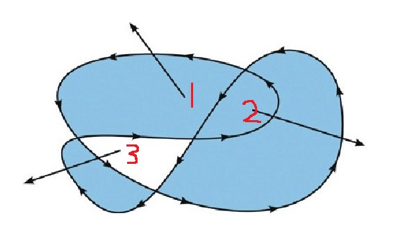

### canvas


绘图步骤:

```javascript
//1.先在html页面中写一个canvas标签
//<canvas width="600" height="800" id="cas"></canvas>

//2.获取绘图工具(绘图上下文)
//getContext方法可以用来获取绘图工具,传递的参数有两种:
	//1. 2d 获取2d绘图工具
	//2. webgl  获取3d绘图工具 three.js
var cas=document.getElementById("cas");
var ctx=cas.getContext("2d");//绘图上下文

//3.开始绘图
 	//3.1 落笔 选择一个绘图的起点
ctx.moveTo(100,100);//xy轴坐标
	//3.2 告诉绘图工具,绘制到哪里去
ctx.lineTo(400,100);
	//3.3 开始画线
ctx.stroke();//moveTo到lineTo的点画线

//4.关闭路径 将最后的lineTo点跟最新的moveTo点连接 会自动补全两条线之间的拐角,但是lineTo在线结束点不会自动补全拐角.
ctx.closePath();

//作业:五角星

//填充:将画布中所有封闭的图形进行填充 
ctx.fill();
//线宽
ctx.lineWidth();
```

1. 绘图上下文.moveTo(x,y)--->设置起点;必须有起点位置;或者会将第一个lineTo默认成起点位置;
2. 绘图上下文.lineTo(x,y)--->中间路过的点;
3. 绘图上下文.stroke()--->将所有点依次连接;

##### 图形填充 fill()方法

​	填充满足非零环绕原则

从空间内拉出一条直线,计算经过这个直线的垂直路径,是否全部相互抵消,若是,则不填充,反之则否;



##### 描边 stroke()方法

​	


##### 路径 beginPath()-->重新定义路径

一个路径中包含所有的需要绘制的内容,以及绘制这些内容所需要遵循的方式;

**每次stroke或者fill操作,会对当前路径上绘制的所有内容进行再次渲染;**

当需要绘制新的图形时,需要换一个新的路径绘图--->beginPath();


##### 线型相关属性

​	属性会保存到beginPath新开的路径中;在新开的路径中重新设置可覆盖继承的属性;

1. 线宽--->.lineWidth;

   ​	定义当前路径上的所有线宽;

2. 描边的颜色-->.strokeStyle;

   ​	颜色格式同css;

3. 填充的颜色--->fillStyle;

   ​	颜色格式同css;

4. lineCap--->square 方帽子 round圆帽子  butt默认没帽子

5. lineJoin--->两条线相交位置的样式--->round圆 bevel平 miter默认没效果 尖的

##### 虚线绘制.setLineDash()-->设置虚线的样式

1. .setLineDash([num])--->规定虚线间空白的长度

2. .setLineDash([num1,num2,num3...])--->参数是一个数组,数组中的每一个元素表示的都是宽度,循环表示虚线每一部分的宽度;

   ​	setLineDash([]);--->参数是空数组可重新设置成实线;

3. getLineDash()-->获取setLineDash的参数;

4. 属性lineDashOffset--->设置虚线的偏移量,正值左偏,负值右偏;

##### 保存和恢复绘图工具的状态

save()--->保存当前画布的所有绘图工具状态;包括颜色线宽等属性,

restore()--->将之前保存好的状态恢复回来;

​	两者都可以被调用多次,但是每次调用restore,恢复的都是最后一个save的状态.

​	save和restore一般是成对出现的;


##### 绘制矩形的方法

1. 绘制一个描边的矩形,不会创建任何路径

   strokeRect(x,y,w,h)--->参数是xy坐标和矩形宽高;

2. 绘制一个填充的矩形,也不会创建任何路径,

   fillRect(x,y,w,h)--->参数同上

3. 绘制一个矩形的路径

   rect(x,y,w,h)--->只是绘制路径,后面加stroke()才会显示;


##### 清除画布指定区域的内容

clearRect(x,y,w,h)--->橡皮擦是矩形形状,

##### 绘制运动的矩形

```javascript
if(a>b) step=-step;
```

##### 画弧

arc(x,y,r,startAngle,endAngle,antiClockWise)--->只是表示路径

​	x,y:圆心坐标;

​	r:半径;

​	startAngle:起始角度(弧度制);用派表示角度;0度在x轴正方向;

​	endAngle:结束角度,派表示

​	antiClockWise:是否进行逆时针绘制,默认是false;角度还是顺时针不会变,只是绘制是逆时针绘制;


##### 绘制扇形图

##### Math内置对象

1. `Math.acos()` 返回一个数的反余弦值（单位为弧度），即：`acos` 方法以 -1 到 1 的一个数为参数，返回一个 0 到 pi （弧度）的数值。如果传入的参数值超出了限定的范围，将返回 `NaN`。
2. **Math.acosh()**`返回一个数字的反双曲余弦值，即：`返回指定参数的反双曲余弦值，如果指定的参数小于 1 则返回[`NaN`](https://developer.mozilla.org/zh-CN/docs/Web/JavaScript/Reference/Global_Objects/NaN)。
3. `Math.asin()` 方法返回一个数值的反正弦（单位为弧度），即：asin 方法接受 -1 到 1 之间的数值作为参数，返回一个介于 - π/2  到  π/2  弧度的数值。如果接受的参数值超出范围，则返回 NaN。
4. `Math.atan()` 函数返回一个数值的反正切（以弧度为单位），即：atan 返回一个 - π/2  到  π/2  弧度之间的数值。
5. `Math.atan2()` 返回其参数比值的反正切值。atan2 方法返回一个 -pi 到 pi 之间的数值，表示点 (x, y) 对应的偏移角度。这是一个逆时针角度，以弧度为单位，正X轴和点 (x, y) 与原点连线 之间。注意此函数接受的参数：先传递 y 坐标，然后是 x 坐标。`atan2` 接受单独的 x 和 y 参数，而 `atan` 接受两个参数的比值。
6. `Math.cos()` 函数返回一个数值的余弦值。`cos` 方法返回一个 -1 到 1 之间的数值，表示角度（单位：弧度）的余弦值。参数是一个以弧度为单位的数值。
7. `Math.sin()` 函数返回一个数值的正弦值。`sin` 方法返回一个 -1 到 1 之间的数值，表示给定角度（单位：弧度）的正弦值。参数是一个以弧度为单位的数值。
8. `Math.sqrt()` 函数返回一个数的平方根，即：参数是一个数值.如果参数 `number` 为负值，则 `sqrt` 返回 `NaN`。
9. `Math.pow()` 函数返回基数（`base`）的指数（`exponent`）次幂`，即` `base^exponent`。
10. **Math.sign()** 函数返回一个数字的符号, 指示数字是正数，负数还是零。此函数共有5种返回值, 分别是** 1, -1, 0, -0, NaN.** 代表的各是**正数, 负数, 正零, 负零, NaN**。传入该函数的参数会被**隐式转换**成数字类型。
11. `Math.log2()` 函数返回一个数字以 2 为底的对数.Math.log2(1024)  // 10
12. `Math.log()` 函数返回一个数的自然对数，即：以e为底.  而下面的函数返回以 `x` 为底 `y` 的对数（既logx y）：`function getBaseLog(x, y) {    return Math.log(y) / Math.log(x);}`
13. ​


### event事件

e.offsetX e.offsetY表示的就是鼠标在当前盒子里的坐标


#### canvas事件

1. ctx.isPointInPath(x,y)--->判断指定的点是否在当前绘制好的路径当中.即,当前未闭合的路径.一般结合.react()使用;做**碰撞检测**;


##### 绘制文本

1. **ctx.strokeText(text,x,y,maxWidth)**--->描边文字

   text:文本内容;

   xy:坐标;在文字的**左下基线**位置;

   maxWidth:可选的参数,表示文本显示最大宽度,设置后会**挤压**文字.

2. **ctx.font="40px 楷体"**--->更改字体大小的属性

3. **ctx.fillText(text,x,y,maxWidth)**--->填充文字


##### 文本的对齐方式

1. 水平对齐:以坐标点对齐

   **ctx.textAlign="start"(默认值);**--->属性值: left  center  right  start  end

   **start和end对齐方式和文本的方向(css中的direction属性,值有rtl和ltr)有关系,**

2. 垂直对齐:

   ctx.textBaseline="alphabetic"(默认值); --->属性值:top  middle  bottom ;不常用的属性值:hanging(基线处于文本正上方贴着);  ideographic(和bottom特别像);alphabetic(默认值,基线对齐);

```javascript
ctx.font="40px Consolas";
ctx.fillText("Hello world",100,100);
```

3. 测量文本宽度:

   **ctx.measureText(text)**--->测量指定的文本在当前绘图上下文字体情况下的显示出来的宽度.返回对象,属性是width;


#### 画布中绘制图片

**ctx.drawImage(img,x,y);**--->

​	要等图片加载完成才能绘制到canvas里,img.onload

1. 3参模式:ctx.drawImage(img,x,y);

   img:要绘制的图片;--->可以是img标签元素,也可以是new Image创建出来的图片元素,也可以是另一个canvas元素,也可以是video标签(监听play,把每一帧画入canvas.);

   x,y:图片左上角坐标;

   ```javascript
   //通过Image构造函数可以快速创建一个图片对象,但是没有加进页面中.
   var img= new Image();
   img.src="";
   img.onload=function(){
     ctx.drawImage(img,0,0);
   }
   ```

2. 5参模式:ctx.drawImage(img,x,y,w,h);

   将图片以指定的尺寸,绘制到指定的坐标;

   不提供自动等比例的效果,需手动设置比例;

   ```javascript
   var img=new Image();
   ig.src="";
   ig.onload=function(){
     ctx.drawImage(img,0,0,cas.width,cas.height);
   }
   ```

3. 9参模式:ctx.drawImage(img,x,y,w,h,x1,y1,w1,h1);

   **9参模式可以实现图片的裁剪功能**, 

   第一组的x,y,w,h,指图片的一个矩形区域;xy是相对图片的坐标.wh是要裁剪的宽高;

   第二组的x1,y1,w1,h1,指的是在canvas中的一个矩形区域;

   功能:将图片中指定矩形区域中的

##### 将video放进canvas

​	监听video的播放和暂停事件,在事件内设置定时器刷新图片,制作出视频帧播放的效果.video的当前画面可直接绘制进canvas,--->`ctx.drawImage(video,x,y,w,h)` 

```javascript
//监听video的播放和暂停事件,在事件内设置定时器刷新图片,制作出视频帧播放的效果.
var timer;
video.addEventListener("play",function () {
      timer=window.setInterval(function () {
        ctx.clearRect(0,0,cas.width,cas.height);
        ctx.drawImage(video,0,0,400,220);
      },30);
    });
 video.addEventListener("pause",function () {
      window.clearInterval(timer);
    });
 video.addEventListener("ended",function () {
      window.clearInterval(timer);
    });
```


#### 序列帧动画绘制

设置定时器,每次进入定时器,清除之前绘制的图片,将下一帧图片绘制出来.

**一般一个区域内有动态的图形,那这整个区域都会被擦掉后重新绘制.**

```javascript
//设置定时器,每次都擦掉图片,重新绘制下一帧的不同动作的图片
setInterval(function(){
  //先清除整个画布
  ctx.clearRect(x1,y1,cas.width,cas.height);
  //然后裁剪图片显示一部分在画布上
  ctx.drawImage(img,x,y,w,h,x1,y1,w1,h1);
  //通过控制x,y值来显示同一个图片的不同的部分
  //通过控制x1,y1值俩操作图片在画布中的位置
})
```


#### 变换

​	**变换的属性均是叠加的,并且状态可被save()方法保存;并且对设置前已绘制的图形无影响.**

1. 平移变换(对画布进行平移)--->画布原点平移;

   ctx.translate(x,y)--->x:将画布沿x轴平移;y:将画布沿y轴平移;

   改变画布原点位置后只对后面的绘制有影响,在此之前已绘制的图形无影响.并且平移设置会叠加;

2. 旋转变换(对画布进行旋转)--->围绕**画布原点**旋转;

   ctx.rotate(angle)--->角度是弧度制,π表示.2π=360度;

   将画布围绕原点旋转;并且旋转设置会叠加;

3. 缩放变换(对画布进行缩放)--->也是对已绘制的图无影响.

   ctx.scale(x,y);--->xy:x,y轴缩放的倍数;对画布进行缩放;并且也是叠加的.

##### 绘制旋转的正方形

功能:绘制在canvas中心点旋转的正方形--->实现:先将画布的原点移动到canvas的中心,再将正方形的中心对应上画布的原点;

**save()和restore()的应用**

每次**绘制固定的图形需要在正常的画布状态下**,所以在绘制旋转正方形,对画布进行平移旋转之前,将正常的状态保存一份,在画布变换之前,先将固定的图形绘制完成,再操作画布变换,最后做动态的图形;

```javascript
setInterval(function () {
    ctx.clearRect(-x,-y,cas.width,cas.height);//先清除画布
    
    ctx.save();//保存画布正常状态
    //在画布正常状态前后重绘固定的背景 这样就不会被后面画布移动旋转影响到了
    ctx.drawImage(img,0,0,cas.width,cas.width*567/440);
    
    //平移画布
    ctx.translate(x,y);//将画布原点移动到canvas中心
    angle +=speed;
    if(angle>=360) angle=0;
    ctx.rotate(angle);//旋转画布,效果叠加
    ctx.strokeRect(-width/2,-width/2,width,width);//矩形的中心对应上画布的中心
    ctx.restore();//恢复画布正常状态
  },200)
```

#### window.requestAnimationFrame方法

用来做动画的;性能比定时器好,

```javascript
function render(){
  //动画代码
  window.requestAnimationFrame(render);
  //这个方法会将render函数放进动画队列里,当调用这个函数时又会再放一份到动画队列里
}
```

##### 多张图片加载完成事件

数下加载的图片总数来判断;

```javascript
//封装一个函数,参数传入所有图片的数组和callback,功能是数组中所有图片加载完再执行callback函数.
var imgs=["img1","img2"];//图片名称
function loadImg(imgs,callback){
  var count=0;
  var imgsDOM={};//创建一个盒子盛放创建出来的img对象
  for(var i=0;i<imgs.length;i++){
    var img=new Image();
    imgsDOM[imgs[i]]=img;
    img.src="./imgage/"+imgs[i]+".png";
    img.onload=function(){
      count++;
      if(count==imgs.length){
        //当计数器等于数组长度,则所有图片加载完成
        callback(imgsDOM);//用户传入的参数.图片加载完成后的执行代码,将所有的图片对象当做实参反传给用户
      }
    }
  }
}
loadImg(imgs,function(imgsDOM){
  console.log("图片加载完成");
  //获取图片对象
  ctx.
});
```


### flybird

1. 绘制小鸟

   1. 设定小鸟位置-->加载小鸟图片-->绘制小鸟图片到canvas中-->绘制小鸟的动画-->绘制小鸟的下落-->给小鸟的y坐标加上下落的变化值-->更新速度值
   2. 注册点击事件小鸟往上跳-->修改速度为负值
   3. 设置小鸟下落的倾斜度-->旋转画布-->记得保存正常状态并恢复

2. 绘制天空

   1. 在save前后绘制天空-->绘制在小鸟前面-->让天空图片移动-->两张图片移动

3. 绘制陆地

   ```javascript
   index %=3;//取0,1,2
   s=v*t+a*t*t/2;//计算小鸟的位移,每次绘制都更新高度,a=0.003;
   t=lastTime-startTime;//每次重新绘制小鸟的时间差,用来计算s
   v=v0+a*t;//更新小鸟的速度;
   //小鸟倾斜度:当前角度/最大角度60度=当前速度/最大速度0.3;
   //天空移动时变换第一张图片的位移是
   skyX += skyW*2;//可以消除两张图片之间的间隙

   //beginPath()方法可以清空之前画好的路径rect();
   //isPointPath(x,y);xy是否在当前的未闭合路径中
   ```

4.封装对象  画面中的天空是个对象,陆地是一个对象,都封装成对象,可以避免很多冗余代码.

```javascript
{
        x:0,
        y:0,
        ctx:ctx,
        img:imgsDOM["sky"]
      }
```

5. **注意事项**:

   ​	1.一定要在清除画布后面绘制所有的图形,不能在清除画布前面绘制!!

   ​	2.