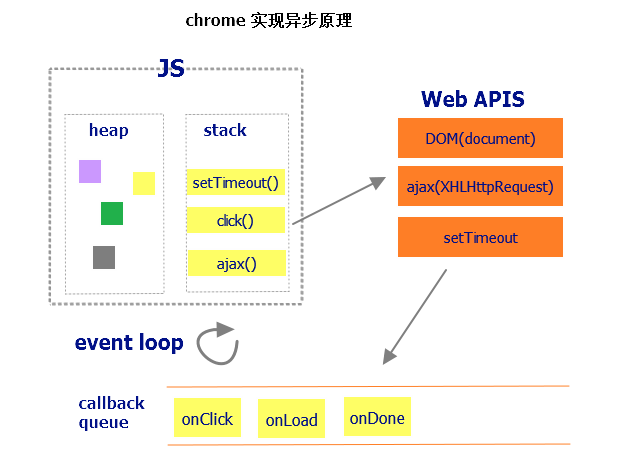

# node js

 $任务队列是一个先进先出的数据结构，排在前面的事件，优先被主线程读取。$

$V8引擎同时也是Node.js的javascript解释器​$ 

### js引擎

```text
JavaScript 引擎：FireFox 的 SpiderMonkey，IE/Edge 的 Chakra，Chrome/Opera 的 V8，Safari 的 JavaScriptCore
```

#### 渲染引擎 又叫 排版引擎 或 浏览器内核。

```text
- Chrome浏览器: Blink引擎（WebKit的一个分支）。
- Safari浏览器: WebKit引擎，windows版本2008年3月18日推出正式版，但苹果已于2012年7月25日停止开发Windows版的Safari。
- FireFox浏览器: Gecko引擎。
- Opera浏览器: Blink引擎(早期版使用Presto引擎）。
- Internet Explorer浏览器: Trident引擎。
- Microsoft Edge浏览器: EdgeHTML引擎（Trident的一个分支）。

```

### js实现异步的原理



### 浏览器工作原理

####浏览器渲染页面的原理

```text
1.解析HTML文件，创建DOM树

自上而下，遇到任何样式（link、style）与脚本（script）都会阻塞（外部样式不阻塞后续外部脚本的加载）。

2.解析CSS 

优先级：浏览器默认设置<用户设置<外部样式<内联样式<HTML中的style样式；

特定级：id数100+类或伪类数10+tag名称*1

3.将CSS与DOM合并，构建渲染树（renderingtree）

DOM树与HTML一一对应，渲染树会忽略诸如head、display:none的元素.这个过程叫"layout" 或 "reflow"。

4. 绘制渲染树，调用操作系统底层API进行绘图操作。
布局和绘制，重绘（repaint）和重排（reflow）

重排：若渲染树的一部分更新，且尺寸变化，就会发生重排；

重绘：部分节点需要更新，但不改变其他集合形状。如改变某个元素的颜色，就会发生重绘。 

附：

1.重绘和重排何时会发生：

（1）增加或删除DOM节点；

（2）display:none（重排并重绘）；visibility:hidden（重排）；

（3）移动页面中的元素；

（4）增加或修改样式；

（5）用户改变窗口大小，滚动页面等。

2.如何减少重绘和重排以提升页面性能：

（1）不要一个个修改属性，应通过一个class来修改

错误写法：div.style.width="50px";div.style.top="60px";

正确写法：div.className+=" modify";

（2）clone节点，在副本中修改，然后直接替换当前的节点；

（3）若要频繁获取计算后的样式，请暂存起来；

（4）降低受影响的节点：在页面顶部插入节点将影响后续所有节点。而绝对定位的元素改变会影响较少的元素；

（5）批量添加DOM：多个DOM插入或修改，应组成一个长的字符串后一次性放入DOM。使用innerHTML永远比DOM操作快。

```

####浏览器访问网站全过程

```
1. 在浏览器地址栏输入网址
2. 浏览器通过用户在地址栏输入的URL构建HTTP请求报文
3. 浏览器发起DNS解析请求,将域名转换为IP地址
4. 浏览器将请求报文发送给服务器
5. 服务器接受请求报文并解析
6. 服务器处理用户请求,并将处理结果封装成HTTP响应报文
7. 服务器将HTTP响应报文发送给浏览器
8. 浏览器接受服务器响应的HTTP报文,并解析
9. 浏览器解析HTML页面并展示,在解析HTML页面时遇到新的资源需要再次发起请求
10. 最终浏览器展示出页面
```


###node的一些模块

环境变量:全局变量

静态网页:服务器读取磁盘直接返回资源

动态网页:服务器先执行资源代码,然后处理之后再返回结果.

**模块都有很多很多的方法,要记得**

#### global模块	

`process.stdout.write('b')` 标准输出不换行,全局模块,不需要require

####非global模块,即local模块?

`console.log('b')` 输出换行全局模块,不需要require

`readline` 非全局模块,需要`require('readline')` 


### File System 文件模块

文件读取和写入都是异步执行的.若要同步,请使用`fs.readFileSync(file[,options])` 

```js
// 创建文件模块
var fs = require('fs');
var msg = 'hello world!';
// 文件写入 参数是 路径,写入内容,options,callback
fs.writeFile('./fs.txt', msg, 'utf8', function (err) {
  if (err) throw err;
  console.log('文件写入成功');
});
// 文件读取
// 相对路径是相对运行 node 的路径
fs.readFile('./fs.txt', function (err, data) {
  if (err) throw err;
  // 默认读取到的data默认是 buffer 对象,即二进制,需要将data转换为字符串对象
  // 若在 readfile() 传入 utf8 ,则不需要转换 data ,直接就是字符串
  console.log('文件读取成功:' + data.toString('utf8'));
})
```

1. 在文件读写的时候,写 './' 相对路径,表示的是相对于当前启动node命令的路径, 而不是正在执行js文件的路径.
2. `__dirname` 永远表示正在执行的 js 文件所在的路径
3. `__filename` 永远表示正在执行的 js 文件的完整路径
4. 所以 文件读写的路径写作 `__dirname+ "\\fs.txt"` 但是存在不同操作系统路径写法不同的兼容性问题

### Path 路径模块

针对以上问题, 可用path模块解决:

```js
// 文件读取
var path = require('path');
var filename = path.join(__dirname, 'fs.txt')
fs.readFile(filename, function (err, data) {
  if (err) throw err;
  // 默认读取到的data默认是 buffer 对象,即二进制,需要将data转换为字符串对象
  // 若在 readfile() 传入 utf8 ,则不需要转换 data ,直接就是字符串
  console.log('文件读取成功:' + data.toString('utf8'));
})
```


### Errors 捕获异步代码异常

1. `try-catch`  无法捕获异步代码的异常
2. 异步操作进行错误判断,只能在回调函数中,通过判断 err 错误对象来处理.
3. 错误优先: error-first  在回调函数的参数中, 一般第一个参数都是错误对象.


### HTTP  模块创建http服务

```js
// 创建 http 模块
var http = require('http');
//创建 http 服务
var server = http.createServer();
// 监听 server 对象的 request 事件( 用户请求事件 )
server.on('request', function (req, res) {
  // 参数是 request 和 response
  // 设置响应头 格式为 text/html 或者 text/plain 纯文本格式, 浏览器解析编码指定为 utf-8
  res.setHeader('content-Type', 'text/html;charset=utf-8;');
  // 设置响应体
  res.write('<h1>hello world</h1>');
  // 每个请求最后都必须结束响应
  res.end(); // 必不可少 否则浏览器一直处于等待响应结束状态
});
// 启动服务器
server.listen(9999, function () {
  console.log('服务器已经启动,请访问:http://localhost:9999');
});
```

```js
//
var server=http.createServer(function(req,res){
    //当用户有 request 的时候会执行这里的代码,只监听 request 事件
})
```

```js
res.end(buffer | );//只能写二进制和字符串
```

2. 响应报文头的content-Type 用mine模块来自动填写,根据请求文件名,用npm下载`res.setHeader('content-Type', mime.lookup(req.url));` 

   ```js
   //先安装 mine 模块
   npm install mime
   //在 js 中创建该模块
   var mime=require('mime');
   //根据请求路径直接获取到请求文件对应的 content-Type 的正确设置 用lookup()方法
   mime.lookup(req.url);
   //如下实现:
   fs.readFile(path.join(__dirname, 'demo', req.url), function (err, data) {
         if (err) throw err;
         res.setHeader('content-Type', mime.lookup(req.url));
         res.end(data);
         return;
       });

   ```

3. 读取对应文件的读取流,并返回这个读取流,通过`pipe()` 方法把读取流传递给 response 对象,然后内部res对象会自动`end()`

   ```js
   fs.createReadStream(path.join(__dirname,'index.html')).pipe(res);//这种方法是同步操作,通过try-catch来捕获错误
   ```

   ​

路径

1. `./` 相对路径:html里的相对路径是相对于url里吐出HTML页面的路径的路径;
2. `/` 绝对路径
3. src的请求路径对于服务器来说就是个标示,开心返回啥都行.

###Common System Errors - 常见错误号

- EACCES (Permission denied)
  - An attempt was made to access a file in a way forbidden by its file access permissions.
  - 访问被拒绝
- EADDRINUSE (Address already in use)
  - An attempt to bind a server (net, http, or https) to a local address failed due to another server on the local system already occupying that address.
  - 地址正在被使用（比如：端口号备占用）
- EEXIST (File exists)
  - An existing file was the target of an operation that required that the target not exist.
  - 文件已经存在
- EISDIR (Is a directory)
  - An operation expected a file, but the given pathname was a directory.
  - 给定的路径是目录
- ENOENT (No such file or directory)
  - Commonly raised by fs operations to indicate that a component of the specified pathname does not exist -- no entity (file or directory) could be found by the given path.
  - 文件 或 目录不存在
- ENOTDIR (Not a directory)
  - A component of the given pathname existed, but was not a directory as expected. Commonly raised by fs.readdir.
  - 给定的路径不是目录

### Node版本管理器

1. 先下载版本管理器,[地址]()
2. ​

`nvm use 6.11.1` 切换使用的node版本

`nvm install node` 下载最新的node版本

`nvm version` 查看版本

`nvm uninstall 版本号` 卸载版本号

`nvm list` 已经安装的node版本list

### request和response对象

**request 对象**  类型是`class:http.IncomingMessage` ,继承自`readable.stream` 

常用的对象成员:

`request.url` 获取请求的路径

`request.Headers` 请求报文头,封装到对象中

`request.rawHeaders` 将请求报文头放到字符串数组

`request.httpVersion` 获取http版本号

`request.method` 获取请求的方式, post 或者 get


**response 对象** 类型是[Class: http.ServerResponse](https://nodejs.org/dist/latest-v6.x/docs/api/http.html#http_class_http_serverresponse) 

`res.write()`

`res.end()` 请求必须调用一次,且只能调用一次,告诉服务器该响应数据都已发送,可以结束本次响应了

`res.setHeader(name,value)` 两次设置会被覆盖,所以可用数组表示

```js
response.setHeader('Set-Cookie', ['type=ninja', 'language=javascript']);
```

`res.statusCode=404; res.statusMessage='Not Found';` 设置好向客户端发送的 http 状态码和 http 状态消息,待发送

 `res.writeHead(statusCode[, statusMessage][, headers])` 向客户端发送响应报文头和状态码状态消息,该方法会在 `res.end()` 和`res.write()` 时自动调用该方法.或者手动设置时一定要在end 和 write 之前设置;只能调用一次


### NPM安装

npm全局安装其他模块时,意思仅仅是可以在命令行使用这个模块写一些命令


```js
//mine.js
//The mine script accepts js source and returns all the require call locations as well as the target string.
var mine = require('js-linker/mine.js');
var fs = require('fs');
var code = fs.readFileSync("test.js");
var deps = mine(code);
```

### 设计路由

路由就是请求路径`req.url`加上请求方式`post/get`,合称路由


### url模块

1. 当服务器处理 get 请求时，用户请求的参数是在 request 的 url 属性中，纯字符串，使用起来并不方便

2. url 模块可以更方便地解析用户 get 请求提交上来的参数

3. 加载模块 `var url = require('url');`

4. 调用`parse()`方法解析

   ```js
   url.parse(urlString[, parseQueryString[, slashesDenoteHost]]);
   var urlObj = url.parse(reqUrl, true);

   // url对象的pathname属性，获取不包含查询字符串的url
   // url对象的query属性中包含的就是请求字符串的键值对对象
   ```

   ​

**get请求** 

1. 在node中,用户 get 方式提交数据,,通过 内置对象 url 模块来获取参数.

   ```js
   //创建 url 模块
   var url=require('url');
   //调用 url 模块的方法解析请求的 url (将url字符串解析成一个url 对象)
   var urlObj=url.parse(req.url,true);//true 得到url镀锡 且会让query字符串变成对象
   //最后得到如下:urlObj.query对象,里面是参数键值对
   ```

2. 将用户传输的数据保存到 data.json 中

   ```js
   //先将data.json数据放入list[]中
   fs.readFile(path.join(__dirname,'data','data.json'),'utf8',function(err,data){
       if(err && err.code !== 'ENOENT'){
           //排除一种情况: data.json 文件不存在 第一次存储时
         throw err;
       } 
     var list = JSON.parse(data || "[]");
   })
   //将参数对象放入数组
   list.push(urlObj.query);
   //将数组放入data.json文件 这步会将data.json数据覆盖重写 所以需要将data.json数据先放入list中
   fs.writeFile(path.join(__dirname,'data','data.json'),JSON.stringify(list),'utf8',function(err){
       if(err) throw err;
     console.log('文件写入成功');
   });
   //判断页面的pathname是否符合
   req.url.pathname=='/add'?
   ```

3. 文件写入成功后,跳转页面到 /index 或 / (首页),服务器设置响应报文头让浏览器跳转页面

   ```js
   //代码写在异步回调函数内 文件保存成功后再执行跳转
   res.statusCode=302;//3开头表示重定向
   res.statusMessage='Found';
   res.setHeader('Location','/');
   res.end();//结束请求
   ```


**post请求** 

1. 获取用户 post 提交的数据 监听 request 的 data 事件和 end 事件

   ```js
   //监听request的data事件
   var arr=[];//保存每个提交的buffer对象
   //回调函数的参数chunk表示一块数据,是buffer类型的对象
   req.on('data',function(chunk){
       //每次用户传输数据都会触发这个事件
     arr.push(chunk);
   });
   //再监听request的end事件
   req.on('end',function(){
       //所有数据提交完毕会触发这个事件
     //把arr里的n个buffer对象转成一个buffer对象
     var body = Buffer.concat(arr);//Buffer的concat方法,返回一个合并的buffer对象,即body对象,参数是数组
     //把buffer转成字符串
     body = body.toString('utf8');
     //把字符串转成json对象 query string模块实现 parse方法
     var querystring = require('querystring')
     body = querystring.parse(body);
   });
   ```

   ​

2. 读取 data.json 文件中的数据,并将其转换为一个list数据

3. 把用户 post 提交的数据写入到 list 数组

4. 把 list 写入 data.json 文件中

5. 重定向


**封装读取写入 data.json 文件的代码和获取 post 请求的数据** 

**针对异步函数,如何获取回调函数的结果??**

```js
//封装函数内部有一个异步调用函数,要获取异步函数的回调函数内部返回值,代码如下:
function readData(callback){
    fs.readFile(path.join(__dirname,'data.json'),function(err,data){
        //代码块 最后有一个return 值 这个值得借助callback参数传出去
      callback(returData);      
    });
}

//调用函数
readData(function(returnData){
  //针对函数返回值 returnData 执行代码块
    returnData.push(...);
});

```


### underscore.js

[官方文档](http://underscorejs.org/)  [中文文档](http://www.bootcss.com/p/underscore/)   [在npm中搜索underscore](https://www.npmjs.com/package/underscore)

```text
1、Underscore is a JavaScript library that provides a whole mess of useful functional programming helpers without extending any built-in objects. 

2、Underscore 是一个 JavaScript 工具库，它提供了一整套函数式编程的实用功能，但是没有扩展任何 JavaScript 内置对象。 他解决了这个问题：“如果我面对一个空白的 HTML 页面，并希望立即开始工作，我需要什么？” 他弥补了 jQuery 没有实现的功能，同时又是 Backbone 必不可少的部分。

Underscore 提供了100多个函数，包括常用的：map、filter、invoke — 当然还有更多专业的辅助函数，如：函数绑定、JavaScript 模板功能、创建快速索引、强类型相等测试等等。
```

**使用说明**

1. 先将字符串格式的 html 扔进`_.template()` 中,返回一个函数-->`var fn = _.template(html)` 
2. 再将模板数据(对象)放进fn函数中-->`var result = fn(templateData)` 
3. 最后的result就是要返回给浏览器的HTML页面,然后就可以在html页面中写`<% %>` 表达式了.

```js
<%= %> // 中间写表达式
<%    %> // 中间写js语句

//提示：underscore库建议使用'_'来命名对象，类似于jQuery使用$来命名
// 案例一：
  
var html = '<h1><%= name %></h1>';
var compiled = _.template(html);
var result = compiled({name: 'aaaa'});
console.log(compiled);

// 案例二：
// 构建模板字符串
var html = '<%for (var i = 0; i < 5; i++) { %><h1><%= name %></h1><% }%>';

// 编译模板
var compiled = _.template(html);

// 进行模板字符串替换
var result = compiled({name: '张三'});

// 输出后的结果
console.log(result);
```

underscore中_.template()函数返回值其实就是一个函数：

```js
function(obj){
  var __t;
  var __p = '';
  var __j = Array.prototype.join,print = function () {
    __p += __j.call(arguments,'');
  };

  with(obj||{}) {
    __p += '<h1>' + ((__t = (name)) == null ? '' : __t) + '</h1>';
  }
  return __p;
}
```

### 模块化

通过 require( 'path' ) 加载文件模块时, 加载成功就会直接执行一遍.模块加载完成后才会执行其他的;同一个模块只加载一个,后来就用缓存的模块.

path 相对路径或者绝对路径,相对路径是相对于当前模块,不需要借助`__dirname` 

在Node.js中模主要分为：核心模块 和 文件模块

核心模块

- http、fs、path、url、net、os、readline、......
- 核心模块在Node.js自身源码编译时，已经编译成二进制文件
- 部分核心模块在Node.js进程启动的时候已经默认加载到缓存里面了

文件模块(包含独立文件模块和第三方模块)

- 文件模块可以是：*.js 模块、*.node模块、*.json模块，这些都是文件模块
- 无论从npm上下载的第三方模块还是我们自己编写的模块都是文件模块

module.exports 和 exports

在每个模块中module表示当前模块对象, 里面保存了当前模块对象的各种信息

module.exports 其实就是 require()加载模块时的返回值

exports 就是module.exports的一个引用

```javascript
exports = module.exports;
```

特别注意：最终暴露给require的返回值的是：module.exports, 而不是exports

```javascript
  // To illustrate（说明） the behavior, imagine this hypothetical implementation of require(), which is quite similar to what is actually done by require():

  function require(...) {
  var module = { exports: {} };


  ((module, exports) => {
    // Your module code here. In this example, define a function.
    function some_func() {};
    exports = some_func;
    // At this point, exports is no longer a shortcut to module.exports, and
    // this module will still export an empty default object.
    module.exports = some_func;
    // At this point, the module will now export some_func, instead of the
    // default object.
  })(module, module.exports);

  
  return module.exports;
}
```

require 加载模块时做了2件事

1. 执行了模块中的代码
2. 返回了模块中对外暴露的内容（可能是对象、函数等等）

下载Node.js源码，打开看下

JavaScript 的严格模式—— `"use strict";` 或 `'use strict';`

- 参考链接：
  1. http://www.ruanyifeng.com/blog/2013/01/javascript_strict_mode.html
  2. https://developer.mozilla.org/zh-CN/docs/Web/JavaScript/Reference/Strict_mode

### express框架

功能:路由; 中间件(方法函数); 对res和rep的扩展; 可以集成其他模板引擎;

针对nodejs的一套封装好的框架,提供一些简单的方法使用,实现原生node复杂代码的功能.

**模板引擎 ejs ** 

`npm install ejs` 下载,npm官网有介绍

**集成模板引擎到express中**

有一些模板引擎支持集成到express中,在[这里](https://www.npmjs.com/package/ejs) 查询

使用步骤:

1. 先引入express,加载express模块,创建app

   ```js
   var express = require('express');
   var app = express();
   ```

2. 配置使用[ejs](https://www.npmjs.com/package/ejs) 模板引擎

   ```js
   var template = ejs.compile(str, options);
   template(data);
   // => Rendered HTML string 
    
   ejs.render(str, data, options);
   // => Rendered HTML string 
    
   ejs.renderFile(filename, data, options, function(err, str){
       // str => Rendered HTML string 
   });
   ```

3. [路由模块](https://expressjs.com/en/4x/api.html#router) 配置

   ```js
   // 1. 创建路由模块 router
   ```


   // 2. 通过路由对象 router 挂载各种路由


   // 3. 最后将 路由对象 router 暴露
   ```

4. 业务模块配置,连接到数据库`mongodb` ,对外暴露一个对象,对象上挂载各种处理不同路由的业务方法

   ```js
   // 1. 加载 mongodb 模块

   // 2. 处理不同路由的业务方法
   ```

5. [mongodb nodejs 的api](http://mongodb.github.io/node-mongodb-native/2.2/api/) 的数据读取和添加

   ```js
   var MongoClient = require('mongodb').MongoClient,
     test = require('assert');
   // Connection url
   var url = 'mongodb://localhost:27017/test';
   // Connect using MongoClient
   MongoClient.connect(url, function(err, db) {
     // Use the admin database for the operation
     var adminDb = db.admin();
     // List all the available databases
     adminDb.listDatabases(function(err, dbs) {
       test.equal(null, err);
       test.ok(dbs.databases.length > 0);
       db.close();
     });
   });
   ```

   ​

6. [`bodyParser()` 中间件](https://www.npmjs.com/package/body-parser) ,可以解析客户端请求的body中的内容,内部使用JSON编码处理,url编码处理以及对于文件的上传处理.

   只能处理`enctype = 'application/x-www-form-urlencoded'` ,不能处理`enctype = ''

   ```js
   var bodyParser = require('body-parser');
   app.use(express.bodyParser());//让res对象就具有了一个files属性
   //另外bodyParse可以接受客户端ajax提交的json数据,以及url的处理.
   ```

   ​

### mongoDB

[官网](https://www.mongodb.com/) 

1. `mongod + 回车` 开启mongoDB服务器

2. `mongo + 回车` 连接本机数据库

3. `show dbs` 显示当前数据库文件列表

4. `db` 显示当前数据库

5. `use test` 切换到这个数据库,如果有的话

6. `use test ` 没有test数据库,则会创建,但是需要在里面存储数据才会保留下这个数据库,(switched to db test)

7. `db.demo.insert({name:'zs',age:18});` 在当前数据库里插入一条数据

8. `db.demo.find();` 查找demo集合里的所有数据记录

9. `db.demo.find().pretty();` 格式化查询结果

10. `db.demo.find({age:18});` 查询所有age = 18 的数据

11. `db.demo.find({age:{$lt:18}}).pretty();` 查询年龄小于18岁的数据;

    ```text
    $lt:小于
    $gt:大于
    $lte:小于等于
    $gte:大于等于
    $ne:不等于
    ```

12. `db.demo.update({name:'zs'},{$set:{name:'ls'}});` 更新记录中的name值,只更新第一天

13. `db.demo.update({name:'zs'},{name:'ls'});` 把整条数据都替换掉

14. `db.demo.update({name:'zs'},{$set:{name:'ls'}},{multi:true});` 更新所有数据

15. `db.demo.


### nodejs抓取网络数据????

1. 正则表达式

2. `cheerio`模块

   ​

   ```js
   ????
   ```

   ### fiddle工具

   用来模拟后台接口返回数据；


### 中间件

`next()` 如果不是最后一个中间件，一定要调用`next()` 将请求交给下一个注册的中间件处理；下一个中间件路由匹配则会执行；

错误处理中间件必须有四个参数：err/req/res/next;  其他中间件抛错时`next(err)` 会自动转到错误处理中间件；