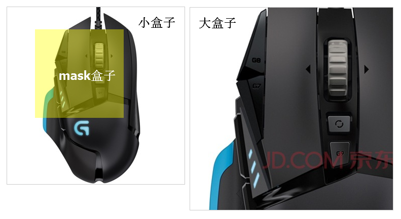

### 弹幕效果

1. 给发送按钮注册点击事件--->获取文本框值(判断加清空)--->生成弹幕盒子--->设置初始位置在屏幕外--->动画使弹幕盒子跑到屏幕另一边--->动画callback里清除弹幕盒子--->注册onkeyup事件,e.keycode==13,即enter按钮,触发发送按钮点击事件.

### 放大镜

1. 给小盒子注册mousemove事件-->获取鼠标位置-->把鼠标放到mask盒子中间-->限定mask的移动范围(最大值和最小值)
2. 大图片随着鼠标移动,等比例移动
3. 小盒子注册鼠标进入显示两个盒子,鼠标离开隐藏两个盒子.




### 正则校验

### 判断鼠标进入盒子方向

```javascript
$("#wrap").bind("mouseenter mouseleave",
      function(e) {
        var w = $(this).width();
        var h = $(this).height();
        var x = (e.pageX - this.offsetLeft - (w / 2)) * (w > h ? (h / w) : 1);
        var y = (e.pageY - this.offsetTop - (h / 2)) * (h > w ? (w / h) : 1);
        console.log([e.pageX,e.pageY]);
        console.log([this.offsetLeft,this.offsetTop]);
        console.log([x,y]);
        var direction = Math.round((((Math.atan2(y, x) * (180 / Math.PI)) + 180) / 90) + 3) % 4;
        var eventType = e.type;
        var dirName = new Array('上方','右侧','下方','左侧');
        if(e.type == 'mouseenter'){
          $(this).html(dirName[direction]+'进入');
        }else{
          $(this).html(dirName[direction]+'离开');
        }
      });
```

