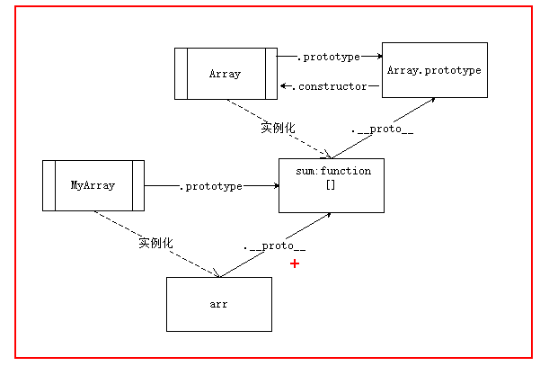
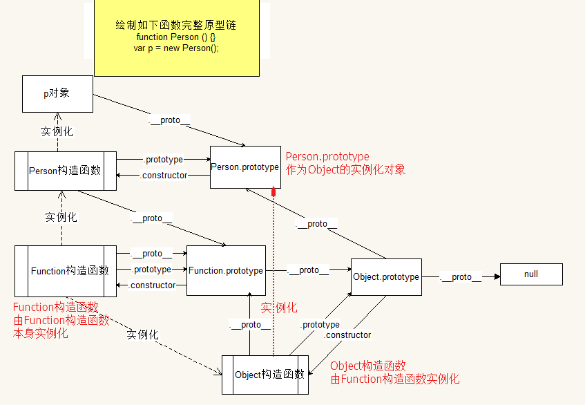
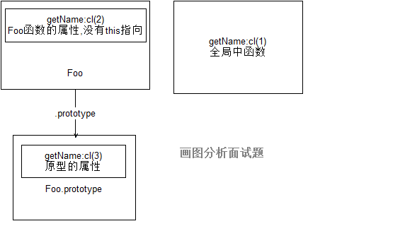
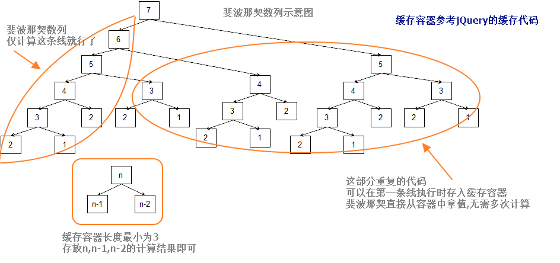

### 面向对象基本定义

+ 面向对象 Object-Oriented OO语言都有类的概念,而通过类可以创建多个具有相同属性和方法的对象.
+ in
  + for_in:遍历对象

  + "属性" in object:判断object是否可以访问这个属性

  + **对象的属性能否被遍历是可以设置的?Object.defineProperty**

  + Object.defineProperty:修改属性默认的特性,ECMA5,接受三个参数:属性所在的对象,属性的名字和一个描述符对象,,其中,描述符对象的属性必须是:configurable/enumerable/writable和value,设置其中一个或多个值,可以修改对应的特性值,如下:


+ **能够具体到某一项事物上,才叫做对象;但是例如手机,指的是一类事物,就不能称为对象.**

+ new关键字是创建对象

+ 检测对象类型:instanceof ---> `obj instanceof Object 返回true or false` 

+ js中无序的键值对集合,称为对象

+ 面向过程:解决问题的思路,专注于解决的步骤

+ 函数封装存在的问题:1.全局变量污染(全局的函数也算是全局变量); 2. 代码结构混乱,不利于维护;  解决:放进局部,划分模块.有利于代码复用;

+ 面向对象的三大特性:

  + **封装;就是将功能的具体实现封装在对象内部,只对外部暴露指定接口,外界在使用对象的时候,只需要考虑接口如何使用,而不需要关系内部功能的具体实现,这就是封装.**

  + **继承:一个对象有一些属性和方法,另外一个对象没有,拿过来用,这就是继承;**

    + ```javascript
      var a={};
      var b={
        money:100,
        sayHi:function(){}
      };
      //混入式继承 简单的继承操作 不推荐使用
      for(var k in b){
        a[k]=b[k];
      }
      ```

  + 多态: js中没有多态,强类型语言才有多态,js本身就是多态的.例如声明变量时不用指定数据类型 

+ 创建对象的方式:

  + 对象字面量:var obj={};  简洁易写,复用性差

  + 内置构造函数:new object:复用性差

  + 自定义构造函数:复用性好

    + ```javascript
      function Person(name,age){
        this.name=name;
        this.age=age;
      }
      var p=new Person("zs",19)
      ```

### 构造函数

+ 构造函数的执行过程:

  + 先用new关键字开辟空间,创建空对象
  + 执行构造函数,将构造函数中的this指向刚刚new创建出来的对象,
  + 执行构造函数中代码使用this为刚刚的对象添加属性和方法
  + 默认将this,即new创建出来的对象返回,初始化对象

+ 构造函数的注意事项:

  + 构造函数有自己的返回值,不需要写return
    + 如果写了return, return 值类型,对默认返回值没有影响,return 引用类型,则将会返回引用类型,原先的默认值被丢弃不会返回.
  + 如果把构造函数当做普通函数调用:
    + 返回值就是return 的值,没有return,则是undefined
    + 构造函数里的this指向window,给this加的属性方法都加给了window,也就相当于全局变量.

+ 构造函数的特征:

  + 函数名首字母大写
  + 要和new关键字一起使用
  + this指向new创建出来的对象
  + 不需要写return语句,会自己默认返回new创建出来的对象
  + 初始化对象
  + 任何函数只要通过new操作符来调用,那它就可以作为构造函数,反之则就是个普通函数

+ 构造函数存在的问题:

  + new新建对象,每次都会将构造函数内的函数声明copy一份,会造成内存资源浪费,

    **解决方案**:将函数声明从构造函数中提取出来放在全局,那这个函数声明只会执行一次,在构造函数内,将已经声明的函数地址给到方法.

    + ```javascript
      function Person(name,age){
        this.name=name;
        this.age=age;
        this.sayHi=fnc;
      }
      function fnc(){
        console.log("Hi");
      }
      ```

    + **但是存在全局变量污染,所以将方法的函数放到原型里.**

### 原型  prototype

+ **新的函数**在创建出来的时候,系统会直接帮忙创建一个**prototype属性,这个属性是一个指针**,指向一个对象,这个对象包含构造函数创建的所有实例共享的属性和方法.
+ 构造函数初始化对象,调用过程是实例化,构造函数的实例即是创建后的对象,prototype的作用是:原型属性指向一个对象,原型中可以有属性和方法,可以被相关联的构造函数实例化的对象使用属性和方法.
+ 访问原型:  构造函数名.prototype;
+ 原型中的属性和方法是共享给实例化的对象的.实例对象指向的是同一个函数即方法;
+ **当调用构造函数创建一个新实例后,该实例内部将包含一个指针,指向构造函数的原型对象,即实例对象.`__proto__` .**
+ 原型的注意事项:
  + 原型中一般只会放一些需要被共享的内容,方法居多,属性一般不做共享
  + 当使用对象访问某一个属性的时候,会先在对象自身进行查找,然后在原型链中进行查找.
  + 当使用对象为某个属性进行重新赋值操作,或者新定义一个属性,则不会去原型中增删改查,只会在对象中修改增加属性,**使用delete操作符可以完全删除实例属性,从而让实例能够重新访问原型中的属性.**
  + 当对构造函数的prototype属性赋值对象时,赋值对象前后创建的实例化对象指向的原型不一样.所以一般在构造函数下面区域定义原型,固定这个区域修改,否则会导致代码难以维护
+ 原型的两种使用形式:
  + 利用对象的动态特性,为原型新增属性方法.`object.prototype.fn=function(){}` 或者`object.prototype["fn"]=function(){}` 
  + prototype相当于构造函数的属性,直接给prototype赋值;`object.prototype={}` ,这时构造函数名.prototype指向了新的{}.抛弃了prototype.
  + ​
+ 原型的访问方式:
  + 构造函数名.prototype;
  + 对象.`__proto__` 是非标准,有兼容性问题,不推荐使用
+ 原型对象中,默认会有一个**constructor**属性,这个属性指向的就是和此原型关联的构造函数.这个属性是系统默认给的prototype,如果prototype重新赋值新对象,新对象里没有constructor属性.一般自己手动添加constructor,指向构造函数.


### 原型链

+ 是个对象就有原型,原型也是对象,也有原型,这样原型组成的链式结构,称为原型链.
+ **一定要注意指针与值的区别,当属性值是值类型,实例修改属性会直接覆盖掉原型的属性,但是原型属性值是引用类型,则实例修改属性时会同时修改原型的属性**
+ `var arr=[];` 的原型链是--->Array()--->object()--->null;
+ object.prototype是js中所有对象的原型链的终点,所以他的属性和方法都可以被使用.
+ 属性搜索原则:
  + 在对象自身进行查找,然后往原型链的方向寻找.直到object.prototype为止
  + 实例与原型之间的连接就是一个指针而已,实例中的指针仅指向原型,不指向构造函数


### 继承

#### 1.混入式继承

```javascript
var obj={};
var obj1={
  name:"zs",
  age:19
}
for(var k in obj1){
  obj[k]=obj1[k];
}//obj1变成obj的原型属性
```


#### 2.原型继承(要有构造函数)

2.1利用混入的方式,将要继承的对象的所有的属性和方法添加到当前对象的原型中

```javascript
function Person() {
  
}//先有一个构造函数
var obj=new Person();//实例化对象

var obj1={
  name:"zs",
  age:19,
  make:function(){
    console.log("hehe");
  }
}
//将obj1的方法属性加到obj的原型中
for(var k in obj){
  Pesron.prototype[k]=obj[k];
}
//完成原型继承
//验证:
console.log(obj.make);
```

2.2 直接将要继承的对象作为当前对象的原型,原型的意义就是拿来继承的

```javascript
Person.prototype=obj1;//构造函数指向原型的指针已经变了
var obj=new Person();
console.log(obj.make);
```

#### 3  Object.create(); 经典继承

Object.creat():将上述的继承方法封装,原理同上.内部实现一样.

```javascript
var obj= Object.creat("要继承的对象");
//Object.creat()方法可以用来创建一个对象,这个对象的原型就是参数,
//其实就是将参数中传入的对象,作为了新对象的原型.
```

此方法ECMA5.1才有,所以有兼容性问题.这时需要自己封装这个函数使用,jQuery的create方法效率比我们自己封装的高.所以优先使用jQuery的方法.

```javascript
function myCreat(obj){
  if(Object.creat){
  return Object.creat(obj);
}else{
  function F(){};
  F.prototype=obj;
  return new F();
}
}
```

### 扩充

Object的prototype属性是唯读的,但是可以往这个原型对象里添加属性方法.`Object.prototype.extend=function(){}` 

jQuery的extend方法是将一个或多个对象的内容合并到目标对象,若只有一个参数,则合并到jQuery中去

### 如何安全的扩展内置对象

**jQuery中加插件是`jQuery.fn.myExtend=function(){}`** 

 自定义

将sum方法加进我自己的数组方法中,可以用继承来将内置数组原型的属性方法拿到后,在自定义的数组中加入我自己的属性方法.

```javascript
function MyArray(){
  
}
MyArray.prototype=[];
MyArray.prototype.sum=function(){}
var arr= new MyArray();
console.log(arr.sum());
```




### Object.prototype

Object.prototype是js中所有对象的源,所有对象都可以用他的属性方法.

##### 1. obj.hasOwnPrototype("属性");

obj中,"属性"是否是自己的属性

#####	2. obj.isPrototypeOf("另一个对象")

判断obj是否是另一个对象的原型

##### 3. prototypeIsEnumerable()

属性是否可被枚举(遍历);被for_in遍历到.prototypeEnumerable("属性名")首先判断属性是否属于对象本身,然后再判断能否被for_in遍历,

##### 4. toLocaleString  /  toString

Date()对象等,跟区域差异有关的,两者打印出来的都不相同

toString打印出来的就是通用格式,toLocaleString打印的是本地格式,从电脑设置里获取区域信息.

[object Object]--->[typeof 构造函数名称]

```javascript
var obj={};
obj.toString();//[object Object]
var arr=[];
arr.toString();//空,数组直接调用的是自己原型中的tostring方法,所以要调用Object的toString方法.如下
Object.prototype.toString.call(arr);//[object Array];
```

##### 5. valueOf() 获取对象的值

当引用类型和值类型数据运算的时候,会先调用valueOf方法,尝试使用返回值运算,如果不能运算,就继续调用toString方法获取返回值运算.

### 创建函数的方式 

#### 1. 创建函数的方式

1.1函数声明:`function函数名(){}`

1.2函数表达式`var 函数名=function(){}`

1.3通过Function构造函数创建`var 函数名=new Function();` 

#### 2. 函数

**函数拥有双重身份,函数和对象,都可以生效,**

函数:可以被调用

对象:拥有对象的一切特性

构造函数:可以用来初始化对象

js中所有函数都有原型属性,	

#### 3. Function的使用说明

js中所有的函数都可以认为是Function的实例,Function是js中所有函数对象的构造函数.

Function的使用

1. 不传递参数:创建了空函数

2. 传递一个参数:`var fn=new Function("console.log('hehe');alert('haha')")` 参数是字符串,可被当做函数体用js语法识别.

3. 传递形参:传递多个参数,最后一个参数被当做函数体使用,前面的参数都会被当做形参.所有参数都是字符串.

   ```javascript
   var fn=new Function("a","b","return a+b;");
   ```

   ​

4. 字符串里换行:\和``,**ES6的模板字符串**

   ```javascript
   var a="ab\
   c";
   var b=`abcd
   edf`;
   ```


#### eval函数

是一个全局函数,可以将字符串转换成js代码并直接运行

用来实现四则运算很简单,但是存在安全问题

eval和Function都有安全性问题,所以一般情况下不会使用,毕竟字符串识别转代码,可实现xss攻击.而且两者还会影响浏览器性能优化,编译器无法优化eval的上下文.[xss就是在页面执行你想要的js]

json格式字符串转js对象的时候,因为JSON.parse()有兼容性问题,如果直接用eval来转换json格式字符串.会报错,

**{}花括号不仅可以表示对象还可以表示代码段,单独使用{}的时候,里面的东西会被当做代码段处理,所以会报语法错误**

解决:只要将eval将json字符串中的{}当做对象字面量处理即可.`eval("var hcc="+jsonString)`

```javascript
var jsonString='{"name":"hcc","age":15}';
//第一个
eval("var hcc="+jsonString);
//第二个
eval("("+jsonString+")");
```


#### 函数作对象的时候,分析函数对象的原型关系

函数当做对象来处理时,形同Date()的原型链;

##### 函数对象常见的属性

`function Person(){} console.dir(Person)   ` 可查看函数的属性;

**name属性:在函数表达式中,函数名是不能在外面拿来调用函数的,但是可以在函数内部使用,可写递归函数**

```javascript
var fn=function sayHello(){
  console.log(sayHello);//打印出函数体
}
fn.name;//sayHello
sayHello();//报错
```

```javascript
var fn=new Function();
fn.name;//anonymity匿名函数
```

**length属性,表示当前函数的形参个数;**

arguments属性:`fn.arguments` 和arguments对象一样的功能,但是这个属性只能在函数内部获取到值.都是盛放所有传入参数的伪数组.

caller属性:`fn.caller` 必须在函数内部调用,才能获取到值,当前函数是在哪个函数中调用的,caller指的就是这个外面的函数,如果是全局调用,caller指的是null.不过已经快废弃了.

##### arguments对象

arguments是函数内部的一个局部变量,所以只能在函数内使用;

arguments是伪数组,不能使用数组的方法,当函数调用的时候,arguments对象会将所有传入的实参存入到自身;

arguments.length:传入实参个数;

arguments.callee:指的是当前函数本身;可以自调用,匿名函数可用,或者函数名被占用的情况;可辅助实现函数的递归;但是严格模式下不支持;

**在严格模式下不能通过脚本访问arguments.callee,这时用命名函数表达式来解决:**

```javascript
var factorial=(function f(){
  if(num<=1) return 1;
  return num*f(num-1);
});
//即使函数名被占用,也没事,函数名f依旧生效,这种模式在严格和非严格模式都生效.
```


**函数的重载:函数名相同,参数不一致的函数,称为重载.** 重载就是为了实现传入的参数不同,功能不同.例如jQuery的css()方法.但是js函数没有重载,同名函数只有覆盖.

```javascript
//使用arguments实现函数重载
var obj={};
function value() {
  //设置值的操作
  if(arguments.length==2){
    obj[arguments[0]]=arguments[1];
  }else if(arguments.length==1){
    return obj[arguments[0]];
  }
}
value("key","value");
value("key");
//实现了输入一个参数获取值,输入两个参数设置值的功能,模仿css()方法
```

##### 伪数组

拥有数组的访问形式,也有length属性(**必须有length属性才能被遍历)**可以被for循环遍历,但是**没有数组的方法**. 伪数组的length是固定的不会自动变化,需要手动 进行修改


### 函数完整原型链 

作业:画出函数的完整原型链:内置对象都是由Function构造函数实例化出来的,例如Array(),Date(),Function()本身




##### instanceof关键字

定义:对象是否是构造函数的实例对象.

语法:对象 instanceof 构造函数

功能:判断构造函数的prototype属性所指的对象是否在对象的原型链上,

```javascript
Object instanceof Object;//true

```


##### 深拷贝和浅拷贝

浅拷贝在copy对象时,属性是复制后另起一份,但是遇到方法时还是会copy地址,所以copy出来的备份不是完全copy,原对象的方法和copy对象的方法地址相同指向同一个方法对象,称为浅拷贝;一层复制

```javascript
var hcc = {
  name:"hcc",
  age:17,
  car:{
    brand:"布加迪"
  }
}
//浅拷贝:将对象的属性复制一份,不考虑对象内部的引用类型的属性
function shallowCopy (obj){
  var result={};
  for(var k in obj){
    result[k]=obj[k];
  }
  return result;
}
var shallowObj=shallowCopy(hcc);
//car并没有复制另一份,而是指向原对象的car对象
```


深拷贝是完全另一个对象,跟原本对象完全没关系.

```javascript
var hcc = {
  name:"hcc",
  age:17,
  car:{
    brand:"布加迪"
  }
}
//深拷贝:复制时将所有属性另起一份,包括引用类型属性,而且两个对象互不影响
function deepCopy (obj){
  var result={};
  for(var k in obj){
    if(typeof obj[k] == "object"){
      //要将这个属性再次复制
      /*var temp={};
      for(var j in obj[k]){
        temp[j]=obj[k][j];
      }
      result[k]=temp;*/
      //递归实现
      result[k]=deepCopy(obj[k]);
    }else{
      //值类型的属性直接复制
    result[k]=obj[k];
    }
  }
  return result;
}
var shallowObj=shallowCopy(hcc);
//car并没有复制另一份,而是指向原对象的car对象

//另一个思维的深copy 但是无法复制函数
var newHcc=JSON.parse(JSON.stringify(hcc));
```


学习网址:http://risky.love/2016/10/08/JavaScript%E6%B7%B1%E6%8B%B7%E8%B4%9D%E5%AE%9E%E7%8E%B0/


### 递归

函数内部直接或间接的调用自己,递归存在性能低下问题,但是面试题喜欢考,而且面试喜欢考算法题和js逻辑题.

**两大要素:1.必须有自己调用自己.2.必须要有结束条件,而且调用几次就留几个出口?** 

化归思想:转化和归结

```javascript
//求n的阶乘
function num(n){
  if(n<=1) return 1;
  return num(n-1)*n;
}
console.log(num(3));

//求幂 n的m次方
function mi(n,m){
  if(m<=1) return n;
  return n*mi(n,m-1);
}
console.log(mi(3,2));

//斐波那契数列
function fibonacci(n){
  if(n==1 ||n==2) return 1;
  return fibonacci(n-1)+fibonacci(n-2);
}
```

**面试题:用递归获取页面元素的一种思想**

```javascript
//作业:获取body中所有元素 递归实现
function getElements(ele) {
    //新建数组盛放子元素
    var list=[];
    //先找到第一层的子元素
    var children=ele.children;
    //遍历第一层的子元素
    for(var i = 0; i < children.length; i++){
      //将第一层子元素放入数组
        var child=children[i];
        list.push(child);
      
      //children[i]还有子元素,递归返回第二层子元素
      var childList=getElements(child);
      //将拿到的第二层子元素集合,合并到当前数组中
      list=list.concat(childList);
    }
    return list;//返回数组
  }
  console.log(getElements(document.body));
```

解析图如下:


### 作用域

**js中有且只有函数可以创造作用域. ** 

**js中没有块级作用域,在代码块中限定的作用域就是块级作用域.匿名函数可以用来模仿块级作用域.即匿名函数自调用,`(function(){})();`** 

**js中只有词法作用域.**?

作用域分为2种:1.动态作用域.2.静态作用域(词法作用域);

**词法作用域**:访问的变量只和当前代码的声明有关,和具体调用运行没有关系,只要代码写好,那么访问的变量就确定了.不管有无执行.

js代码执行分两个阶段:预解析阶段和执行阶段;

**变量提升是提升到其所在的作用域顶端.**


#### 变量提升中特殊情况处理:

 1.  函数和变量同名--->只会提升函数声明,变量的声明直接忽略(var不要了)

     ```javascript
     console.log(a);
     function a(){};
     var a=10;
     //声明提升后如下
     function a(){};
     console.log(a);
     a=10;//变量声明被忽略,即丢掉var
     ```

2.变量的提升是分作用域的!

3.变量提升是分段的 (script标签);参考jQuery引用的状况.

​	**当前script标签中的所有变量声明和函数声明,都只会被提升到当前标签的最顶上.** 

4.函数表达式不能被提升.`var fn=function(){}` 提升的是变量`var fn`;

5.条件式函数声明:

​	**在条件语句中声明的函数,在提升的时候会被当做函数表达式处理,最后只会提升函数名称,不会提升函数体.**

```javascript
test();//报错,不会提升函数
if(true){
  function test(){
    console.log("打印");
  }
  //如上函数形同以下
  var test=function(){
    console.log("打印");
  }
}
//最后提升写法如下:
var test;
test();
if(true){
  test=function(){}
}
//面试题
if ("a" in window) {
    var a = 10;
  }
  alert(a);//10
 //提升后如下
    var a;
    if("a" in window) a=10;
    alert(a);//10
```

6.函数中形参的声明以及赋值的过程,是在预解析之前,且不参与预解析过程.

```javascript
function test(a){
  //var a=10;//实参传入,放在最前面,并且不参与预解析
  console.log(a);
  var a=10;
  function a(){};
}
test(100);
```


思路:变量提升--->作用域分析--->做题

`!"a"` 转化为布尔值 false;`var foo;  !foo==!undefined==true`  

```javascript
var foo=12;
function fn(){
  if(!foo){
  var foo=10
}
console.log(foo);
}
fn();//10

```

```javascript
//作业 : 面试题必须熟练
//函数直接调用,返回this指向window
   function Foo() {
   getName = function(){ alert(1); };
   return this;
   }
 
   Foo.getName = function() { alert(2); };
   Foo.prototype.getName = function(){ alert(3); };
   var getName = function() { alert(4); };
   function getName(){ alert(5); }
 
   Foo.getName(); // 2
   getName(); // 4
   Foo().getName(); // 1 Foo()直接调用返回this指向window
   getName(); // 1
   new Foo.getName(); // 2
   new Foo().getName(); // 3  形同var obj=new Foo(); obj.getName();-->新建空对象,Foo中并没有this指向getName函数,所以去原型链中找getName函数
   new new Foo().getName(); // 3  形同var obj=new Foo(); new obj.getName();
```

​	


##### 作用域链

函数可以创建作用域,函数中也可以声明函数,形成**作用域嵌套作用域,自内向外访问的链式结构**,称为作用域链.

变量搜索原则:当使用变量的时候遵守如下原则:	

       	1. 会在当前使用该变量的作用域中,查找该变量(var声明).
     	2. 如果没找到,就沿着作用域链往上查找,直到全局作用域.


### 闭包

一种封闭的包裹结构

由于作用域的关系,函数中声明的变量无法在函数外部访问.

```javascript
//闭包的经典模式
function test(){
  var num=10;
  function inner(){
    console.log(num);
  }
  return inner;//返回内部函数 引用类型 返回地址
}
var fn=test();//在外部访问内部函数 获取地址 指向内存中的内部函数
fn();
```

**闭包:指的是能够访问独立的变量的函数** .变量在本地使用,但是定义在封闭的作用域中.

```javascript
//如何通过闭包实现获取设置数据操作
function test(){
  var num=123;
  return {
    getNum:function(){ return num; },
    setNum:function(pra){ num=pra;  }
  }
}
//获取:
test().getNum();
//设置:
test().setNum();
```

**同一个函数每被调用一次就开辟一块空间,相互之间无联系,**

闭包外部函数调用多次的情况:

​	**一般情况下,外部函数只需调用一次**,这样可以确保我们访问的是同一个数据,若外部函数多次调用,那么我们访问的数据就不是同一份了.

```javascript
function outer(){
  var num=Math.random();
  function inner(){
    return num;
  }
  return inner;
}
var fn=outer();//fn不管调用多少次 拿到的num值都一样 因为outer函数就执行了一次

outer()();
outer()();//outer函数多次调用 开辟多个空间 相互之间无联系 所以两者值不一样
```

闭包应用:

​	闭包会导致内存泄漏,因为闭包的函数一直被占用,所以内存一直被占用.但是闭包可实现基本语法无法实现的特效.但是慎用闭包.存在性能问题.

1. **闭包可以用来保护变量;**

2. **可以为函数设置私有变量;防止全局变量污染**;参考之前的查找body所有子元素的案例,里面的list变量就是函数的私有变量.

   ```javascript
   function outer(){
     var data;
     function test(){}
     return test;//data是test函数的私有变量
   }
   //私有变量解决循环注册点击事件
   //函数运行完才会继续往下执行代码 参数是页面被点击元素集合数组
   //讲道理 还是用自定义下标index来注册点击事件
   function getIndex(eles) {
       for (var i = 0; i < eles.length; i++) {
         eles[i].onclick = function (j) {
           return function () {
             console.log("当前点击的是第" + j + "个div");
           };
         }(i);
       }
     }
   ```

   ​

3. **循环中setTimeout的问题**

   ```javascript
   //打印0-9
   function getTime() {
       for(var i = 0; i < 10; i++){      
         (function (j) {
           setTimeout(function () {
             console.log(j);
           },1000)
         })(i);
       }
     }
   ```

   **补充:js是单线程的,**所有任务都得依次执行;主线程:所有正常从上往下执行的代码.任务队列:setTimeout/setInterval/事件回调/ajax获取服务器数据都是在任务队列中.属于异步操作

   事件队列:次要任务放进事件队列里,等待主线程完成后,再依次执行事件队列里的任务.


### 缓存

cache:缓存,临时存储,作用就是提升效率;

1. 浏览器缓存:

  浏览器输入网址--->服务器接受请求后返回html文件--->浏览器分析html并渲染,遇到外部资源(js图片等文件)--->重新向服务器请求这些文件.

  ​浏览器缓存区域会存储一些网站的外部资源.但是没法及时更新这些资源,解决:**更新的文件重新命名,加版本号**,客户端就会再次请求新的文件;

2. CDN    Content Delivery Network  内容分发网络

   ​	CDN 服务提供商,加速网站文件加载,

3. 硬件缓存 : 

   ​	内存,就是在硬盘和CPU之间将数据进行缓存,因为CPU直接从硬盘读取数据太慢了,所以现将数据缓存到内存中,再由CPU从内存中获取数据,会大大提高读取效率.

   **Linux开源系统,免费;Unix收费,企业用系统;Windows 7等是个人操作系统,Windows 2004等是sever操作系统.**

4. 数据库缓存

   ​	MySQL( 免费)  MSSQL  Oracle :硬盘型数据库,

   ​	MongoDB   Redis  :内存型数据库;

   ​	先往内存型数据库中存储,这样快,然后再往硬盘数据库挪数据.

##### js中缓存的使用


```javascript
//做一个缓存容器,实现功能:存储和获取数据;容器安全不被污染;内存有大小限制存储数据的数量.
//内容大小判断:用空数组存放key值,判断数组长度来限制
//作业:
function creatCache() {
    var cache = {};//容器
    var list=[];//存放容器对象的key值 用来判断容器的大小
    return function (key, value) {
      if (value){
        if(list.length>=3){
          delete cache[list.shift()];
        }
        list.push(key);
        cache[key] = value;
      }else{
        return cache[key];
      }
    }
  }
  var cache=creatCache();//只能开一个createCache函数
 cache("zs",11);
 cache("zx",12);
 cache("ze",13);
 cache("zd",14);
 cache("zc",15);
  
  console.log(cache("zd"));
```


**缓存容器应用**:斐波那契数列性能问题原因是重复代码太多;缓存可以存储已经计算好的函数结果,下次请求可以直接获取结果,这样避免函数重复开辟空间计算.

##### 斐波那契数列计算用缓存容器优化计算过程



```javascript
//作业:斐波那契数列计算用缓存容器优化计算过程
//使用缓存容器存放计算好的函数结果,避免重复计算同一个函数 如下图
//引用之前封装好的函数,缓存容器长度最小是3,即存放n和n-1,n-2的计算结果就行了.
  var cache=creatCache();//放在函数计算外面,不然每次都是新的缓存盒子存储一个数据而已
    function fibo(n) {
      //先在缓存盒子里找下是否有值
      var num=cache(n);
      if(num){
        return num;
      }else{
        if(n==1 || n==2) {
          num=1;
        }else{
          num=fibo(n-1)+fibo(n-2);
        }
        //将计算好的值存入缓存盒子中
        cache(n,num);
        return num;
      }
    }
    console.log(fibo(500));
```

##### jQuery缓存源码

jQuery优秀的缓存代码:

"表达式"（expression）是一个单纯的运算过程，总是有返回值；"语句"（statement）是执行某种操作，没有返回值。

```javascript
//在函数内部存储key值加空格" "--->key+" "--->避免了存入关键字跟函数本身的属性名冲突
//作业:
function createCache(){
            var keys = [];
            function cache(key, value) {
                if(keys.push(key + " ") > 20){
                    delete cache[keys.shift()];
                }
                return (cache[key + " "] = value);//return只是让函数有个返回值,返回值是表达式的等式后面的value值
            }
            return cache;
        }
var cache = createCache();
```


### 自调用函数

立即执行函数表达式(自调用函数)--->ITEF immediately invoked function expression

只要能够让系统将这个函数当做一个表达式,就可以调用;把函数作为句子的一部分,系统就会把函数当做表达式.

```javascript
(function(){})();
+function(){}();
-function(){}();
!function(){}();
~function(){}();
```


**立即执行函数的前后分号一定要加上。** 

##### 沙箱模式

就是自调用函数,作用是隔离;

**一般情况下,会将所有在沙箱中用到的外部内容,全部以传参的形式给到沙箱里;**

```javascript
//沙箱基本模式
(function(外部内容形参){
  var num=1;//变量声明
  function test(){}//功能实现
  
  window.test=test;//如果需要就将内部的函数暴露到全局,暴露接口
})(外部内容实参);//外部内容传入,例如window
//如果需要使用外部内容,就当做参数传进去
```

为什么要把window之类的当做参数传到沙箱内部?

​	**实现逻辑上的隔离;有利于代码压缩;**

代码压缩:内置对象是无法被压缩的,但是传参形式的内置对象名可以被压缩.

##### 数组的高级方法

**在mdn里搜索Array.prototype.filter**

```javascript
//语法:
var new_array = arr.filter(callback[, thisArg])
//参数
	//callback
        //用来测试数组的每个元素的函数。调用时使用参数 (element, index, array)。
        //返回true表示保留该元素（通过测试），false则不保留。
	//thisArg
		//可选。执行 callback 时的用于 this 的值。
	//返回值
      	//一个新的通过测试的元素的集合的数组
```


1. 数组的forEach(fn); --->参考jQuery的each()方法

   ```javascript
   //语法:
     arr.forEach(function (value, index, arr) {//调用次数等于数组长度
       //value:当前正在遍历的数组元素
   	//index:当前遍历元素的下标
   	//arr:当前正在遍历的数组
     })
   //原理实现:
     Array.prototype.myForEach = function (callback) {
       for (var i = 0; i < this.length; i++) {
         callback(this[i], i, this);
       }
     }
     arr.myForEach(function (value, index, arr) {//callback的实参
       console.log(value);
     })
   ```

2. map方法 映射

   1. map方法和forEach一样,也可以用来遍历数组;

   区别:**map方法有返回值且是一个数组,数组中存放的是回调函数每次被调用后的返回值.**

   ```javascript
   //语法:
     arr.map(function(value,index,arr){
       //value:当前正在遍历的数组元素
   	//index:当前遍历元素的下标
   	//arr:当前正在遍历的数组
     })
     //有返回值
     var result=arr.map(fn);
     //原理实现:
     Array.prototype.myMap=function(callback){
       var temp=[];
       for(var i=0;i<this.length;i++){
         temp.push(callback(this[i],i,this));
       }
       return temp;
     }
   ```


3. every()--->判断数组中所有元素是否都满足某个条件,找false

   ```javascript
   //every 返回值是true false
   //判断数组中所有元素是否都满足某个条件
   var flag=arr.every(function (v,i,arr){
     return v>5;//判断所有数组元素都大于5?是的返回true,否则false
   })
   ```

   ​

4. some()--->判断数组中是否有任意元素满足条件,满足一个就返回true,找true.

   ```javascript
   //some 返回值是true false
   //判断数组中是否有满足条件的值,满足一个就返回true
   var flag=arr.some(function(v,i,arr){
     return v>5;//判断数组是否有大于5的元素.
   })
   ```

   ​


##### Object.defineProperty

可以帮对象添加属性,并设置这个属性的特性(能否被删除,遍历,赋值..)还可以用来修改已经有的属性的特性;

如果对象中不存在指定的属性，`Object.defineProperty()`就创建这个属性。

**用来监视对象的属性赋值修改等状态**

```javascript
//语法:
//Object.definePrototype(要添加属性的对象,要添加的属性名,属性的描述信息(特性对象)):
Object.definePrototype(obj,"name",{
  writable:false,//当且仅当该属性的 writable 为 true 时，该属性才能被赋值运算符改变。默认为 false。
  configurable:false,//当且仅当该属性的 configurable 为 true 时，该属性描述符才能够被改变，同时该属性也能从对应的对象上被删除。默认为 false。
  enumerable:false,//当且仅当该属性的 enumerable 为 true 时，该属性才能够出现在对象的枚举属性中。默认为 false。
  value:"hucc",//该属性对应的值。可以是任何有效的 JavaScript 值（数值，对象，函数等）。默认为 undefined。
  //重点:
  //get和set不能和writable和value同时出现--->数据描述符和存取描述符不能混合使用
  get:function(){
    return this._name;
  },//当前用户获取属性值就会触发这个方法,并且获取的属性值就是get函数返回值
  set:function(value){
    this._name=value;
  },//当前用户赋值的时候,触发方法,value就是用户赋值内容,也可不接受参数,然后设置固定值
});
```

赋值运算符:基于右值的值给左值赋值;

补充:

```javascript
//如果 freeze 可用, 防止代码添加或删除对象原型的属性
(Object.freeze||Object)(Object.prototype);
```

​

### 函数的调用模式

####this的指向问题

每个函数都有this,函数中this的指向跟函数的调用模式有关系!(全局也有一个this指向window)**

1. 函数调用模式

   函数名();

   this:指向window对象;

2. 方法调用模式

   对象.方法名();  对象["方法名"]();

   this-->指向调用该方法的对象;

3. 构造函数调用模式

   new  函数名();

   this--->指向新创建的对象;

4.在事件中，this指向触发这个事件的对象，特殊的是，IE中的attachEvent中的this总是指向全局对象Window；

```javascript
//面试题
var length=100;
var obj={
  length:10,
  func:function(){
    arguments[0]();
  }
}
function test(){
  console.log(this.length);
}
obj.func(test,100);//2

 //example2:
  var pattern = {
    get: function () {
      return 'I alway return this string,whatever you have assigned';
    },
    set: function (value) {
      this.myname = 'this is my name string';
    }
  };
  
  function TestDefineSetAndGet() {
    Object.defineProperty(this, 'myproperty', pattern);
  }
  
  var instance = new TestDefineSetAndGet();
  instance.myproperty = 'test';
  delete instance.myproperty;//无法删除 enumerable为false

  console.log(instance.myproperty);//'I alway return this string,whatever you have assigned'
  console.log(instance.myname);//'this is my name string'
```

​

1. 上下文调用模式

   上下文:环境,语境,

   每个函数中的this,这个this指向的就是函数的执行上下文--->执行环境;

   上下文调用模式,就是指可以对上下文进行更改的调用模式

   上下文调用模式的两种方法:

   ​	**Function.prototype.call():传参个数确定时用call**

   ​	让一些内置对象的方法拿出来给别人用,比如伪数组无法使用数组的方法,但是用call就可以用数组的方法--->Array.prototype.方法名.call(伪数组);--->伪数组就可以使用这个方法了.

   **熟记call和apply功能的实现**

   ```javascript
   //call()语法 函数名.call(obj,arg1,arg2...);
   	//obj:想让函数被调用的时候,this指向谁,那么这个对象就传入谁.
   	//arg1...argn:指的就是给函数传递的实参
   function test(a,b){
     console.log(this);
     consolelog(a,b)
   }
   test.call({name:"hcc"},1,2);
   //功能:
   	//1.调用了这个函数test;
   	//2.把函数中的this指向对象{name:"hcc"};
   	//3.把第二个及后面的参数作为实参传给函数;
   ```

   **Function.prototype.apply():要参数个数不确定(动态生成的时候),用apply方法**.

   ```javascript
   //语法:函数名.apply(obj,数组/伪数组);
   //跟call的区别是传参形式不一样,参数个数不确定时,用apply
   test.apply({name:"hcc"},[1,2,3]);
   //功能:
   	//1.调用这个函数test;
   	//2.把this指向对象{name:"hcc"};
   	//3.把数组/伪数组中的元素拆开,作为实参依次传给函数.
   ```

   上下文调用模式注意事项:

   1).test.call()--->如果不给call或者apply传递参数,或者传递null  undefined,则this默认指向window.

   2).test.call(12)--->如果传入值类型,会自动转成对应的引用类型,this指向引用类型.

   ##### 上下文模式的实际应用:

   ```javascript
   //应用场景:
   var obj={};
   obj.toString();//[object Object]
   var arr=[];
   arr.toString();//空,数组直接调用的是自己原型中的tostring方法,所以要调用Object的toString方法.如下
   Object.prototype.toString.call(arr);//[object Array];

   //伪数组转化为真数组

   //数组push方法:
   var fakeArr={
     0:1,
     1:2,
     length:2
   }
   var realArr=[];
   realArr.push.apply(realArr,fakeArr);
   //调用realArr.push方法--->更改this为realArr--->把fakeArr的元素拆解开,依次传递给realArr.push方法作为实参;
   //等效的调用方法:realArr.push(fakeArr[0],fakeArr[1]...);

   //数组concat方法:
   //(concat()参数是单个数值时,默认是单个数值的数组;-->arr.concat(1,2,3)形同arr.concat([1],[2],[3]);
   realArr=realArr.concat.apply(realArr,fakeArr);

   //数组slice()方法:
   var realArr=Array.prototype.slice.call(fakeArr);

   //数组求最大值
   Math.max.apply(null,arr);

   //使用call方法调用函数并且指定上下文的'this'
   function greet() {
     var reply = [this.person, 'Is An Awesome', this.role].join(' ');
     console.log(reply);
   }

   var i = {
     person: 'Douglas Crockford', role: 'Javascript Developer'
   };

   greet.call(i); // Douglas Crockford Is An Awesome Javascript Developer

   //使用call方法调用匿名函数
   var animals = [
     {species: 'Lion', name: 'King'},
     {species: 'Whale', name: 'Fail'}
   ];

   for (var i = 0; i < animals.length; i++) {
     (function (i) { 
       this.print = function () { 
         console.log('#' + i  + ' ' + this.species + ': ' + this.name); 
       } 
       this.print();
     }).call(animals[i], i);
   }
   ```

##### 借用构造函数继承

```javascript
function Product(name, price) {
    this.name = name;
    this.price = price;
  
    if (price < 0) {
      throw RangeError('Cannot create product ' +
          this.name + ' with a negative price');
    }
  }

  function Food(name, price) {
    Product.call(this, name, price);
    this.category = 'food';
  }
  //等同于
  function Food(name, price) {
    this.name = name;
    this.price = price;
    if (price < 0) {
      throw RangeError('Cannot create product ' +
          this.name + ' with a negative price');
    }
  
    this.category = 'food';
  }

  //function Toy 同上
  function Toy(name, price) {
    Product.call(this, name, price);
    this.category = 'toy';
  }

  var cheese = new Food('feta', 5);
  var fun = new Toy('robot', 40);
```
##### 两种创建对象的模式

1. 工厂模式

   ```javascript
   function createPerson(name,age){
     var obj={
       name:name,
       age:age
     }
     return obj;
     console.log(this);//指向window
   }
   var p=creatPerson("hcc",18);
   ```

   ​

2. 寄生模式

   ```javascript
   function Person(name,age){
     var obj={};
     obj.name=name;
     obj.age=age;
     return obj;
     console.log(this);//new出来的对象
   }
   var p=new Person();
   ```

   ​