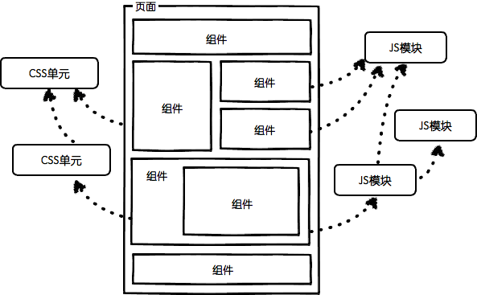

### H5相关

1. 在 HTML 4.01 中，<!DOCTYPE> 声明引用 DTD，因为 HTML 4.01 基于 SGML。DTD 规定了标记语言的规则，这样浏览器才能正确地呈现内容。HTML5 不基于 SGML，所以不需要引用 DTD。


2. box-sizing ： content-box || border-box || inherit;

   ```text
   content-box:
   border-box:
   ```

   ​

3. js计算小数会出现丢失精度问题,将小数扩大10的倍数再计算

   ```js
   function sum() {
         var args = arguments;
         var sum = 0;
         [].forEach.call(args, function (v, i) {
           if (typeof v === 'number') {
             sum += v * 1000;
           }
         });
         return parseFloat((sum / 1000).toFixed(2));
       }
   ```

4. .你做的页面在哪些流览器测试过?这些浏览器的内核分别是什么?
   Ie(Ie内核) 火狐（Gecko） 谷歌（webkit） opear(Presto)

5. JavaScript 引擎：FireFox 的 SpiderMonkey，IE/Edge 的 Chakra，Chrome/Opera 的 V8，Safari 的 JavaScriptCore

6. ```text
   浏览器内核:
   - Chrome浏览器: Blink引擎（WebKit的一个分支）。
   - Safari浏览器: WebKit引擎，windows版本2008年3月18日推出正式版，但苹果已于2012年7月25日停止开发Windows版的Safari。
   - FireFox浏览器: Gecko引擎。
   - Opera浏览器: Blink引擎(早期版使用Presto引擎）。
   - Internet Explorer浏览器: Trident引擎。
   - Microsoft Edge浏览器: EdgeHTML引擎（Trident的一个分支）。
   ```

7. [CSS3新特性](http://www.php.cn/css-tutorial-377983.html) 

   ```text
   1.CSS3中新添加了很多选择器，解决了很多之前需要用javascript才能解决的布局问题。
   2. Transition,Transform和Animation ; 这三个特性是CSS3新增的和动画相关的特性。
   3. 边框: CSS3新增了三个边框属性，分别是border-radius、box-shadow和border-image。
   4. 背景: CSS3新增了几个关于背景的属性，分别是background-clip、background-origin、background-size和background-break。
   5. 文字效果: word-wrap  text-overflow  text-shadow  text-decoration
   ...
   ```

8. JavaScript是一种专为与网页交互而设计的脚本语言，由以下三个不同的部分组成：

   1. **核心(ECMAScript)**：由ECMA-262定义，提供核心语言功能；
   2. **文档对象模型(DOM)**：提供访问和操作网页内容的方法和接口；
   3. **浏览器对象模型(BOM)**：提供与浏览器交互的方法和接口。

9. 静态资源优化方案:

   > 1. 配置超长时间的本地缓存                 —— 节省带宽，提高性能
   > 2. 采用内容摘要作为缓存更新依据      —— 精确的缓存控制
   > 3. 静态资源CDN部署                           —— 优化网络请求
   > 4. 更资源发布路径实现非覆盖式发布  —— 平滑升级

10. nginx

  ```text
  Nginx (engine x) 是一个高性能的HTTP和反向代理服务器，也是一个IMAP/POP3/SMTP服务器。Nginx是由伊戈尔·赛索耶夫为俄罗斯访问量第二的Rambler.ru站点（俄文：Рамблер）开发的，第一个公开版本0.1.0发布于2004年10月4日。
  其将源代码以类BSD许可证的形式发布，因它的稳定性、丰富的功能集、示例配置文件和低系统资源的消耗而闻名。2011年6月1日，nginx 1.0.4发布。
  Nginx是一款轻量级的Web 服务器/反向代理服务器及电子邮件（IMAP/POP3）代理服务器，并在一个BSD-like 协议下发行。其特点是占有内存少，并发能力强，事实上nginx的并发能力确实在同类型的网页服务器中表现较好，中国大陆使用nginx网站用户有：百度、京东、新浪、网易、腾讯、淘宝等。
  在连接高并发的情况下，Nginx是Apache服务器不错的替代品：Nginx在美国是做虚拟主机生意的老板们经常选择的软件平台之一。能够支持高达 50,000 个并发连接数的响应，感谢Nginx为我们选择了 epoll and kqueue作为开发模型。
  ```

11. `WordPress` 

    ```text
    WordPress是使用PHP语言开发的博客平台，用户可以在支持PHP和MySQL数据库的服务器上架设属于自己的网站。也可以把 WordPress当作一个内容管理系统（CMS）来使用。
    WordPress是一款个人博客系统，并逐步演化成一款内容管理系统软件，它是使用PHP语言和MySQL数据库开发的。用户可以在支持 PHP 和 MySQL数据库的服务器上使用自己的博客。
    WordPress有许多第三方开发的免费模板，安装方式简单易用。不过要做一个自己的模板，则需要你有一定的专业知识。比如你至少要懂的标准通用标记语言下的一个应用HTML代码、CSS、PHP等相关知识。
    WordPress官方支持中文版，同时有爱好者开发的第三方中文语言包，如wopus中文语言包。WordPress拥有成千上万个各式插件和不计其数的主题模板样式。[1] 
    ```

12. ​

### WEB worker

### 前端安全问题？

**只允许输入合法的值，其它值一概过滤掉。**

**前端安全**:XSS漏洞和CSRF漏洞;

**后端安全**:SQL注入漏洞;权限控制漏洞;SESSION和cookie;IP地址;验证码;

```javascript
//使用JavaScript来检测页面是否是当前打开页面的最外层，如果不是，将最外层的地址换成本页面的地址，实现方法很简单，如下：
if (top != self) {top.location.replace(self.location.href); }  
```

#### sql注入原理

就是通过把`SQL`命令插入到`Web`表单递交或输入域名或页面请求的查询字符串，最终达到欺骗服务器执行恶意的SQL命令。

总的来说有以下几点：

```
1.永远不要信任用户的输入，要对用户的输入进行校验，可以通过正则表达式，或限制长度，对单引号和双"-"进行转换等。
2.永远不要使用动态拼装SQL，可以使用参数化的SQL或者直接使用存储过程进行数据查询存取。
3.永远不要使用管理员权限的数据库连接，为每个应用使用单独的权限有限的数据库连接。
4.不要把机密信息明文存放，请加密或者hash掉密码和敏感的信息。
5.所有 SQL 语句都使用参数化查询（推荐）或对参数进行 escape（不推荐）
```

#### XSS原理及防范

`Xss(cross-site scripting)`攻击指的是攻击者往Web页面里插入恶意`html`标签或者`javascript`代码。比如：攻击者在论坛中放一个 看似安全的链接，骗取用户点击后，窃取cookie中的用户私密信息；或者攻击者在论坛中加一个恶意表单， 当用户提交表单的时候，却把信息传送到攻击者的服务器中，而不是用户原本以为的信任站点。

常见xss攻击

```html
当找不到图片名为1的文件时，执行alert('xss')
<a href=javascrip:alert('xss')>s</a> 点击s时运行alert('xss')
<iframe src=javascript:alert('xss');height=0 width=0 /><iframe>利用iframe的scr来弹窗
</img>过滤了alert来执行弹窗
```


#### XSS防范方法

1. 代码里对用户输入的地方和变量都需要仔细检查长度和对`”<”,”>”,”;”,”’”`等字符做过滤；其次任何内容写到页面之前都必须加以`html encode`，避免不小心把`html tag` 弄出来。这一个层面做好，至少可以堵住超过一半的`XSS` 攻击。 
2. JavaScript中有三个可以对字符串编码的函数，分别是： escape,encodeURI,encodeURIComponent，相应3个解码函数：unescape,decodeURI,decodeURIComponent 。
3. 避免直接在`cookie` 中泄露用户隐私，例如`email`、密码等等。 3.通过使cookie 和系统ip 绑定来降低`cookie` 泄露后的危险。这样攻击者得到的cookie 没有实际价值，不可能拿来重放。 
4. 尽量采用POST 而非GET 提交表单
5. ​

#### XSS与CSRF有什么区别吗？

`XSS`是获取信息，不需要提前知道其他用户页面的代码和数据包。`CSRF`是代替用户完成指定的动作，需要知道其他用户页面的代码和数据包。

要完成一次CSRF攻击，受害者必须依次完成两个步骤：

　　1.登录受信任网站A，并在本地生成Cookie。 　　2.在不登出A的情况下，访问危险网站B。

#### CSRF的防御

1.服务端的CSRF方式方法很多样，但总的思想都是一致的，就是在客户端页面增加伪随机数。给所有请求加上 token 检查。token 一般是随机字符串，只需确保其不可预测性即可。token 可以在 QueryString、POST body 甚至是 Custom Header 里，但千万不能在 Cookies 里。 2.使用验证码 3.检查 `referer` （请注意，这往往不能防御来自网站自身的 CSRF 攻击，如用户评论中的 `` 就是一个常见触发点）

**权限控制漏洞**

所有地方都要进行权限检查（如是否已登录、当前用户是否有足够权限、该项是否可修改等），总之，不要相信任何来自用户的数据，URL 当然也是

**SESSION 与 COOKIE**

Session 和 Cookie 是两种用于存储用户当前状态的工具。某些开发者不了解 Session 与 Cookie 的区别，误用或者混用，导致敏感信息泄露或者信息篡改。

Cookie 存储在浏览器上，用户可以查看和修改 Cookie。
Session 是存储在服务端的数据，一般来说安全可靠；大多数 Session 都是基于 Cookie 实现的（在 Cookie 中存储一串 SESSION_ID，在服务器上存储该 SESSION_ID 对应的内容）。

**IP 地址**

首先，用户的 IP 地址一般存储在 `REMOTE_ADDR` 中，这是唯一的可信的 IP 地址数据（视不同语言而定）。然后某些代理服务器，会将用户的真实 IP 地址附加在 header 的 `VIA` 或 `X_FORWARDED_FOR` 中（因为`REMOTE_ADDR` 是代理服务器自身的 IP）。所以，要获取用户 IP 地址，一般做法是，判断是否存在 `VIA` 或者 `X_FORWARDED_FOR` 头，如果存在，则使用它们，如果不存在则使用 `REMOTE_ADDR`。这也是网上大多数所谓教程提供的方法。

这就产生问题了，`X_FORWARDED_FOR` 或 `VIA` 是 HTTP Header，换句话说，它们是可以被伪造的。例如，在投票中，如果采信了 `X_FORWARDED_FOR`，往往意味着被刷票。

解决方法：

只使用 `REMOTE_ADDR` 作为获取 IP 的手段。

**验证码**

验证码里常见的问题有：非一次性、容易被识别。

非一次性指的是，同一个验证码可以一直被用下去。一般来说，每进行一次验证码校对（无论正确与否），都应该强制更换或清除 Session 中的验证码。

关于识别问题，在当前科技水平下，不加噪点不加扭曲的验证码几乎是 100% 可识别的。所以大家自己看着办吧…

### 同源策略

[博客详述](http://www.ruanyifeng.com/blog/2016/04/same-origin-policy.html) 

1. **cookie:**

   A网页是`http://w1.example.com/a.html`，B网页是`http://w2.example.com/b.html`，那么只要设置相同的`document.domain`，两个网页就可以共享Cookie。`document.domain = 'example.com';`注意，这种方法只适用于 Cookie 和 iframe 窗口，LocalStorage 和 IndexDB 无法通过这种方法.

   另外，服务器也可以在设置Cookie的时候，指定Cookie的所属域名为一级域名，比如`.example.com`;二级域名和三级域名不用做任何设置，都可以读取这个Cookie。

   ```javascript
   Set-Cookie: key=value; domain=.example.com; path=/
   ```

2. 浏览器窗口有`window.name`属性。这个属性的最大特点是，无论是否同源，只要在同一个窗口里，前一个网页设置了这个属性，后一个网页可以读取它。

3. HTML5为了解决这个问题，引入了一个全新的API：跨文档通信 API（Cross-document messaging）。

   这个API为`window`对象新增了一个`window.postMessage`方法，允许跨窗口通信，不论这两个窗口是否同源。

   举例来说，父窗口`http://aaa.com`向子窗口`http://bbb.com`发消息，调用`postMessage`方法就可以了。

### 耦合度

[耦合度是对模块间关联程度的度量.](耦合的强弱取决于模块间接口的复杂性、调用模块的方式以及通过界面传送数据的多少。模块间的耦合度是指模块之间的依赖关系，包括控制关系、调用关系、数据传递关系。模块间联系越多，其耦合性越强，同时表明其独立性越差。软件设计中通常用耦合度和内聚度作为衡量模块独立程度的标准。划分模块的一个准则就是高内聚低耦合。)

[牵一发而动全身](http://kb.cnblogs.com/page/559642/) 

js中代码耦合:

1. 全局耦合就是几个类、模块共用了全局变量或者全局数据结构，特别是一个变量跨了几个文件。


2. js/html/css耦合--->避免直接在js中修改css样式,而是应该通过增删类名来控制样式.

和耦合相对的是内聚，写代码的原则就是低耦合、高聚合。所谓内聚就是说一个模块的职责功能十分紧密，不可分割，这个模块就是高内聚的。

1. 减少重复代码 : 出现了重复代码 -> 封装成一个函数 -> 封装成一个模块 -> 封装成一个插件，抽象级别不断提高，将共有的特性和有差异的地方分离出来。
2. 封装成一个类


### 浏览器渲染页面的过程

**1.解析HTML文件，创建DOM树**

自上而下，遇到任何样式（link、style）与脚本（script）都会阻塞（外部样式不阻塞后续外部脚本的加载）。

**2.解析CSS**

优先级：浏览器默认设置<用户设置<外部样式<内联样式<HTML中的style样式；
特定级：id数*100+类或伪类数*10+tag名称*1

**3.将CSS与DOM合并，构建渲染树（renderingtree）**

DOM树与HTML一一对应，渲染树会忽略诸如head、display:none的元素

**4.布局和绘制，重绘（repaint）和重排（reflow）**

重排：若渲染树的一部分更新，且尺寸变化，就会发生重排；
重绘：部分节点需要更新，但不改变其他集合形状。如改变某个元素的颜色，就会发生重绘。 

附：

**1.重绘和重排何时会发生：**

（1）增加或删除DOM节点；
（2）display:none（重排并重绘）；visibility:hidden（重排）；
（3）移动页面中的元素；
（4）增加或修改样式；
（5）用户改变窗口大小，滚动页面等。

**2.如何减少重绘和重排以提升页面性能：**

（1）不要一个个修改属性，应通过一个class来修改

错误写法：div.style.width="50px";div.style.top="60px";
正确写法：div.className+=" modify";

（2）clone节点，在副本中修改，然后直接替换当前的节点；
（3）若要频繁获取计算后的样式，请暂存起来；
（4）降低受影响的节点：在页面顶部插入节点将影响后续所有节点。而绝对定位的元素改变会影响较少的元素；
（5）批量添加DOM：多个DOM插入或修改，应组成一个长的字符串后一次性放入DOM。使用innerHTML永远比DOM操作快。


### 观察者模式和异步编程

[阮一峰的异步编程博客](http://www.ruanyifeng.com/blog/2012/12/asynchronous%EF%BC%BFjavascript.html) 

###jquery的ajax原理

[JQuery里Ajax的原理是怎样的？](http://www.cnblogs.com/szny/archive/2011/12/28/2304893.html) 

1、通过 new XMLHttpRequest 或其它的形式（指IE）生成ajax的对象xhr。

2、通过xhr.open(type, url, async, username, password)的形式建立一个连接。

3、通过setRequestHeader设定xhr的请求头部（request header）。

4、通过send(data)请求服务器端的数据。

5、执行在xhr上注册的onreadystatechange回调处理返回数据。


### 链式编程

记得在方法里return this;

```js
function fn(){};
fn.prototype={
    setName:function(name){
        this.name=name;
      	return this;
    },
  getName:function(){
      return this.name;
  },
  setAge:function(age){
      this.age=age;
    return this;
  }
}
function d(){
    return new fn();
}
var name=d().setName('zs').seytAge(18).getName();
```

### 互联网协议入门

[阮一峰互联网协议入门](http://www.ruanyifeng.com/blog/2012/05/internet_protocol_suite_part_i.html) 

1. 实体层传输电信号 0 和 1

2. 以太网:规定电信号构成数据包

3. MAC地址: 以太网数据包标头包含发送者和接受者, 那么接受者网卡就有一个MAC地址,根据ARP协议可以得知MAC地址

4. 广播: 同一个子网络传输数据用广播形式

5. 路由: 不同子网络传输数据包,用路由

6. 网络层: 引入新的地址,区别于MAC地址,即IP地址,建立主机到主机的通信

7. IP协议: 规定网络地址的协议,所定义的地址即IP地址

8. IP地址: 前后分为两部分,网络和主机,网络部分位数不定,由子网隐码确定

9. 子网隐码: 判断两个IP地址是否处于同一个子网络

10. IP数据包: 根据IP协议发送的数据,包含IP地址信息

11. 传输层:建立端口到端口的通信,

12. 端口: 每一个使用网卡的程序的编号,数据包会发送给主机的特定端口,

13. UDP协议: 往数据包里加入端口信息

14. TCP协议: 也是往数据包加端口信息,能确保信息不会遗失,但是过程复杂实现困难消耗资源.

15. 应用层: 规定应用程序的数据格式,是一系列的应用程序协议

    

16. DHCP协议: 设置动态IP地址

17. 电脑联网四个值: `本机IP`  `子网隐码`   `网关IP`   `DNS的IP` 

18. DNS协议: 将网址转换成IP地址

19. HTTP协议: 浏览网页的协议

#### HTTP协议

HTTP是基于TCP/IP协议的应用层协议,不涉及数据包(packet)传输.主要规定了客户端和服务器之间的通信格式，默认使用80端口。

`元数据` : $$描述自身信息的数据$$ ;

HTTP 0.9  1.0  1.1 三个版本

1.1版本引入了持久链接,即TCP连接默认不关闭,可被多个请求复用,对于同一个域名,大多数浏览器允许同时建立6个持久连接.

1.1版本还引入了管道机制,浏览器可同时发送多个请求,服务器挨个响应.

对于一些很耗时的动态操作来说，这意味着，服务器要等到所有操作完成，才能发送数据，显然这样的效率不高。更好的处理方法是，产生一块数据，就发送一块，采用"流模式"（stream）取代"缓存模式"（buffer）。

**特点**

1. 支持客户服务器模式;
2. 简单快速:协议简单,只需传送请求方法和路径;
3. 灵活:http允许传输任意类型的数据对象,由`Content-Type` 标记
4. 无连接:限制每次连接只处理一个请求,服务器处理完客户的请求，并收到客户的应答后，即断开连接。采用这种方式可以节省传输时间。
5. 无状态：HTTP协议是无状态协议。无状态是指协议对于事务处理没有记忆能力。缺少状态意味着如果后续处理需要前面的信息，则它必须重传，这样可能导致每次连接传送的数据量增大。另一方面，在服务器不需要先前信息时它的应答就较快。

**一些指令含义**

1. 请求行:`Method Request-URI HTTP-Version CRLF` Method表示请求方法；Request-URI是一个统一资源标识符；HTTP-Version表示请求的HTTP协议版本；CRLF表示回车和换行(head方法和get方法几乎一样,一般用来测试链接是否有效可访问即更新);

   **请求头**:

2. `Host` :用于指定被请求资源的Internet主机和端口号

3. `User-Agent` :允许客户端将它的操作系统、浏览器和其它属性告诉服务器

4.  `Cache-Control ` :用于指定缓存指令，缓存指令是单向的，且是独立的,no-cache（用于指示请求或响应消息不能缓存）或者 keep-alive

5. `Connection` :允许发送指定连接的选项,指定连接是连续，或者指定“close”选项，通知服务器，在响应完成后，关闭连接

6. `Accept` :用于指定客户端接受哪些类型的信息;text/html

7. `Accept-Encoding` :用于指定可接受的内容编码;如果请求消息中没有设置这个域服务器假定客户端对各种内容编码都可以接受。

8. `Accept-Charset` :用于指定客户端接受的字符集;

9. `Accept-Language` :用于指定一种自然语言

10. `Authorization` :用于证明客户端有权查看某个资源.当浏览器访问一个页面时，如果收到服务器的响应代码为401（未授权），可以发送一个包含Authorization请求报头域的请求，要求服务器对其进行验证。

  ```js
  GET /form.html HTTP/1.1 (CRLF)
  Accept:image/gif,image/x-xbitmap,image/jpeg,application/x-shockwave-flash,application/vnd.ms-excel,application/vnd.ms-powerpoint,application/msword,*/* (CRLF)
  Accept-Language:zh-cn (CRLF)
  Accept-Encoding:gzip,deflate (CRLF)
  If-Modified-Since:Wed,05 Jan 2007 11:21:25 GMT (CRLF)
  If-None-Match:W/"80b1a4c018f3c41:8317" (CRLF)
  User-Agent:Mozilla/4.0(compatible;MSIE6.0;Windows NT 5.0) (CRLF)
  Host:www.guet.edu.cn (CRLF)
  Connection:Keep-Alive (CRLF)
  (CRLF)
  ```

  **响应头**

  1. `Location` :用于重定向接受者到一个新的位置


    2. `Server` :包含了服务器用来处理请求的软件信息,与User-Agent请求报头域是相对应的.`Server：Apache-Coyote/1.1` 
    3. `WWW-Authenticate` :必须被包含在401（未授权的）响应消息中，客户端收到401响应消息时候，并发送Authorization报头域请求服务器对其进行验证时，服务端响应报头就包含该报头域。
    4. `Content-Encoding` 实体报头域被用作媒体类型的修饰符，它的值指示了已经被应用到实体正文的附加内容的编码，因而要获得Content-Type报头域中所引用的媒体类型，必须采用相应的解码机制。Content-Encoding这样用于记录文档的压缩方法，eg：Content-Encoding：gzip
    5. `Content-Language` 实体报头域描述了资源所用的自然语言。没有设置该域则认为实体内容将提供给所有的语言阅读
       者。eg：Content-Language:da
    6. `Content-Length` 实体报头域用于指明实体正文的长度，以字节方式存储的十进制数字来表示。在传送完成前，内存不会释放，攻击者可以利用这个缺陷，连续向WEB服务器发送垃圾数据直至WEB服务器内存耗尽。这种攻击方法基本不会留下痕迹。
    7. `Content-Type` 实体报头域用语指明发送给接收者的实体正文的媒体类型。eg：
       `Content-Type:text/html;charset=ISO-8859-1` 
       `Content-Type:text/html;charset=GB2312` 
    8. `Last-Modified` 实体报头域用于指示资源的最后修改日期和时间
    9. `Expires` 实体报头域给出响应过期的日期和时间。

**补充**

1.  高层协议有：文件传输协议FTP、电子邮件传输协议SMTP、域名系统服务DNS、网络新闻传输协议NNTP和HTTP协议等
2.  中介由三种：代理(Proxy)、网关(Gateway)和通道(Tunnel)
3.  代理(Proxy)：一个中间程序，它可以充当一个服务器，也可以充当一个客户机，为其它客户机建立请求。
4.  网关(Gateway)：一个作为其它服务器中间媒介的服务器。与代理不同的是，网关接受请求就好象对被请求的资源来说它就是源服务器；发出请求的客户机并没有意识到它在同网关打交道。
5.  通道(Tunnel)：是作为两个连接中继的中介程序。一旦激活，通道便被认为不属于HTTP通讯，尽管通道可能是被一个HTTP请求初始化的。当被中继 的连接两端关闭时，通道便消失。当一个门户(Portal)必须存在或中介(Intermediary)不能解释中继的通讯时通道被经常使用。
6.  `Telnet` 协议是TCP/IP协议族中的一员,是Internet远程登陆服务的标准协议和主要方式。它为用户提供了在本地计算机上完成远程主机工作的能力。

**状态码**

状态代码有三位数字组成，第一个数字定义了响应的类别，且有五种可能取值：
1xx：指示信息--表示请求已接收，继续处理
2xx：成功--表示请求已被成功接收、理解、接受
3xx：重定向--要完成请求必须进行更进一步的操作
4xx：客户端错误--请求有语法错误或请求无法实现
5xx：服务器端错误--服务器未能实现合法的请求
常见状态代码、状态描述、说明：
200 OK      //客户端请求成功
400 Bad Request  //客户端请求有语法错误，不能被服务器所理解
401 Unauthorized //请求未经授权，这个状态代码必须和WWW-Authenticate报头域一起使用 
403 Forbidden  //服务器收到请求，但是拒绝提供服务
404 Not Found  //请求资源不存在，eg：输入了错误的URL
500 Internal Server Error //服务器发生不可预期的错误
503 Server Unavailable  //服务器当前不能处理客户端的请求，一段时间后可能恢复正常
eg：HTTP/1.1 200 OK （CRLF）

**三次握手四次挥手**

**从输入域名到最后呈现经历的过程：**

域名解析 --> 发起TCP的3次握手 --> 建立TCP连接后发起http请求 --> 服务器响应http请求，浏览器得到html代码 --> 浏览器解析html代码，并请求html代码中的资源（如js、css、图片等） --> 浏览器对页面进行渲染呈现给用户 --> 四次挥手结束


### 严格模式

1. 使调试更加容易；
2. 防止意外的全局变量；
3. 消除引用未定义值的this强制到全局变量
4. 不允许重复的属性名称或者参数值
5. 使`eval()` 更加安全


### 语义版本号

一个语义版本号，包括三个数字，主版本号：破坏性变更；次版本号：功能性添加，无破坏性变更；修订号：Bug修正，无破坏性变更；

### 模块化和组件化的区别

模块化中的模块一般指的是 Javascript 模块，比如一个用来格式化时间的模块。

组件则包含了 template、style 和 script，而它的 Script 可以由各种模块组成。比如一个显示时间的组件会调用上面的那个格式化时间的模块。




### vue,angular双向数据绑定原理

发布者-订阅者模式（backbone.js）

脏值检查（angular.js） 

数据劫持（vue.js）

**脏值检查:** angular.js 是通过脏值检测的方式比对数据是否有变更，来决定是否更新视图，最简单的方式就是通过 `setInterval()` 定时轮询检测数据变动，当然Google不会这么low，angular只有在指定的事件触发时进入脏值检测，大致如下：

- DOM事件，譬如用户输入文本，点击按钮等。( ng-click )
- XHR响应事件 ( $http )
- 浏览器Location变更事件 ( $location )
- Timer事件( $timeout , $interval )
- 执行 $digest() 或 $apply()

**数据劫持:** vue.js 则是采用数据劫持结合发布者-订阅者模式的方式，通过`Object.defineProperty()`来劫持各个属性的`setter`，`getter`，在数据变动时发布消息给订阅者，触发相应的监听回调。


### 内存泄漏

内存泄露是当一块内存不再被应用程序使用的时候，由于某种原因，这块内存没有返还给操作系统或者空闲内存池的现象

**常见的内存泄漏**

1. 隐式全局变量

   常见的和全局变量相关的引发内存消耗增长的原因就是缓存。缓存存储着可复用的数据。为了让这种做法更高效，必须为缓存的容量规定一个上界。由于缓存不能被及时回收的缘故，缓存无限制地增长会导致很高的内存消耗。

2. 被遗漏的定时器和回调函数

3.  DOM 之外的引用

4. 闭包

**[解决方法](http://www.cnblogs.com/snowwhite/p/6067571.html)  **

1. ​


### 重绘和重排


### 奇淫巧技

1. `Object.prototype.toString.call([]);` 数组调用对象的`toString()` 方法获取`"[object Array]"` 
2. ​

### 面试题

1. NAN是什么？类型？如何测试一个值是否是NAN？

   Number类型，不等于自身，`isNAN()` 最好是使用`value !== value` 来判断，如果值是NAN，返回true，反之为false；ES6有新的`Number.isNAN()` 函数比全局`isNaN()` 更加可靠

2. 函数，用于确定x是否是整数

   ```js
   function isInteger(x){
       return (x^0) === x;// ^ 是按位异或运算符
   }
   ```


3. 按位运算符有6个
   & 按位与
   |按位或
   ^按位异或
   ~取反

   \>>右移

   <<左移

4. ​